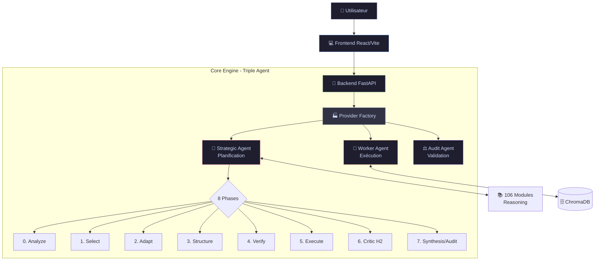
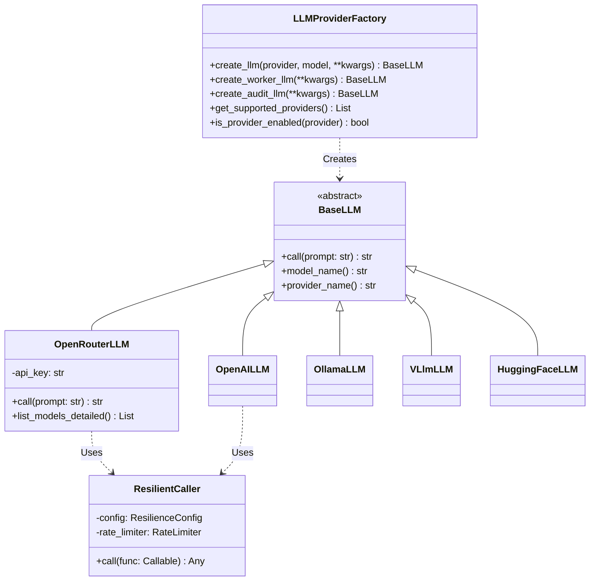
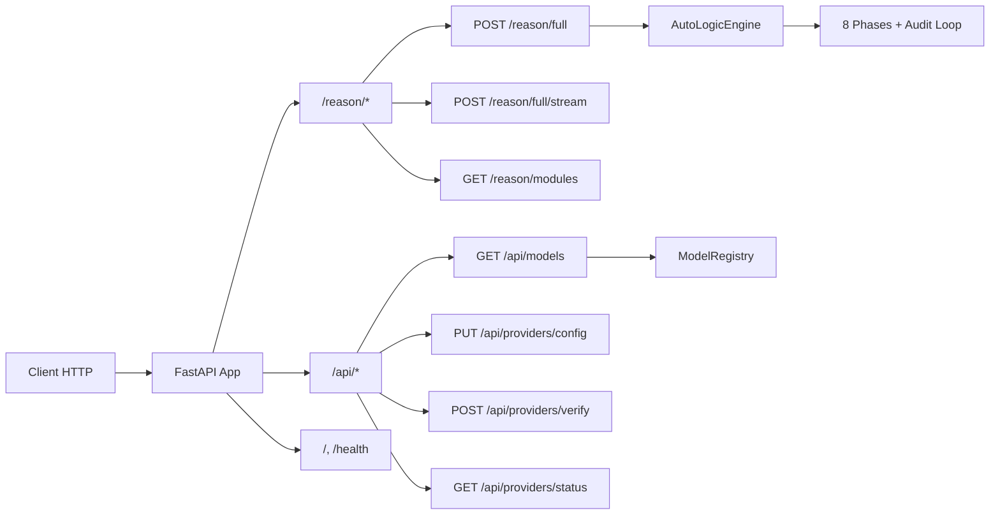

# Architecture du Projet AutoLogic

## Vue d'Ensemble

AutoLogic est un moteur d'inférence cognitif implémentant le **Self-Discovery Reasoning Framework**. L'architecture repose sur une orchestration à **Triple Agent** (Strategic, Worker, Audit) et un cycle de raisonnement en **8 phases**.

---

## Arborescence du Projet

```
AutoLogic/
├── Cmd/                        # Scripts shell standalone
│   ├── start_backend.sh        # Lance le backend FastAPI
│   ├── start_frontend.sh       # Lance le frontend React/Vite
│   ├── run_tests.sh            # Exécute pytest
│   ├── lint.sh                 # Vérifie qualité code (black, flake8, mypy)
│   └── generate_docs.sh        # Génère la documentation Sphinx
├── Code/
│   ├── Backend/
│   │   ├── Phase1-Ingestion/   # Pipeline d'ingestion RAG
│   │   └── Phase2-Inference/   # Logique de raisonnement
│   │       └── 01_Reasoning/
│   │           └── autologic/  # Package principal
│   │               ├── core/           # Moteur, LLM, Factory, Résilience
│   │               │   ├── engine.py           # AutoLogicEngine - Cycle 8 phases
│   │               │   ├── llm_provider.py     # 5 providers LLM
│   │               │   ├── provider_factory.py # Factory Pattern
│   │               │   ├── resilience.py       # Rate limiter, Retry, Fallback
│   │               │   ├── model_registry.py   # Registre des modèles
│   │               │   ├── models.py           # Modèles Pydantic
│   │               │   ├── prompts.py          # Templates de prompts
│   │               │   └── critic.py           # Agent Critic H2
│   │               ├── routers/        # Endpoints FastAPI
│   │               │   ├── reasoning.py        # /reason/* endpoints
│   │               │   ├── models.py           # /api/* endpoints
│   │               │   ├── history.py          # Historique des sessions
│   │               │   └── prompts.py          # Templates API
│   │               ├── utils/          # Logging, helpers
│   │               └── data/           # Modules de raisonnement JSON
│   └── Frontend/               # Application React/Vite
│       └── src/
│           ├── components/     # Composants UI (SettingsDialog, etc.)
│           ├── hooks/          # Custom hooks React
│           ├── services/       # Appels API
│           ├── contexts/       # Contextes React (Theme, etc.)
│           └── types/          # Types TypeScript
├── Config/
│   └── global.yaml             # Configuration centralisée
├── Doc/
│   ├── sphinx/                 # Documentation générée
│   ├── ARCHITECTURE.md         # Ce fichier
│   └── SETUP.md                # Guide d'installation
├── Log/                        # Fichiers de logs
├── Test/                       # Tests automatisés (pytest)
├── .env                        # Variables d'environnement
├── requirements.txt            # Dépendances Python
└── start.sh                    # Script de lancement tout-en-un
```

---

## Architecture Triple Agent

AutoLogic orchestre dynamiquement 3 agents spécialisés pour un raisonnement robuste :



### Rôles des Agents

| Agent | Rôle | LLM Recommandé |
|-------|------|----------------|
| **Strategic (Root)** | Analyse, sélection, adaptation et structuration du plan | GPT-4, Gemini Pro, Claude 3 |
| **Worker** | Exécution des étapes avec accès au contexte RAG | GPT-4o-mini, Llama 3, Mistral |
| **Audit** | Validation qualité, critique H2, synthèse finale | Modèle économique ou gratuit |

---

## Provider Factory Pattern

Le système utilise un **Provider Factory** pour instancier dynamiquement les modèles LLM selon la configuration.



---

## Couche de Résilience

Chaque appel LLM est protégé par une couche de résilience universelle configurable :

1. **Rate Limiter** - Token bucket limitant les requêtes (défaut: 15 req/s)
2. **Retry Mechanism** - Réessai automatique avec backoff exponentiel sur erreurs 429/5xx
3. **Fallback** - Bascule automatique vers modèle alternatif après X tentatives
4. **Timeout Adaptatif** - Gestion fine des délais par provider et agent

```python
@dataclass
class ResilienceConfig:
    rate_limit: float = 15.0        # req/s
    retry_enabled: bool = True
    max_retries: int = 3
    retry_base_delay: float = 2.0   # secondes
    fallback_enabled: bool = True
```

---

## Cycle de Raisonnement (8 Phases)

Le moteur `AutoLogicEngine` orchestre un cycle complet assurant robustesse et qualité :

```mermaid
sequenceDiagram
    participant U as 👤 User
    participant S as 🧠 Strategic (Root)
    participant W as 🔨 Worker
    participant A as ⚖️ Audit
    participant DB as 🗄️ Memory/RAG

    U->>S: 1. Nouvelle Tâche
    Note over S: Phase 0: ANALYSE<br/>Extraction intention & contraintes
    
    rect rgb(30, 30, 46)
        Note right of S: Cycle Self-Discovery
        S->>S: Phase 1: SELECT (106 Modules)
        S->>S: Phase 2: ADAPT (Context)
        S->>S: Phase 3: STRUCTURE (Plan)
    end

    S->>A: Phase 4: VERIFY Plan
    
    alt Plan Invalid
        A-->>S: ❌ Reject (Feedback)
        S->>S: Restructure Plan (Loop)
    else Plan Valid
        A-->>W: ✅ Approved
    end
    
    loop Phase 5: EXECUTE (Step-by-Step)
        W->>DB: Query Context
        DB-->>W: Relevant Chunks
        W->>W: Execute Step
        W->>A: Intermediate Result
    end

    Note over A: Phase 6: CRITIC H2<br/>Score < 0.8 → Double-Backtrack

    W->>S: Execution Trace
    S->>A: Phase 7: SYNTHESIS Request
    
    loop Audit Loop (Time-boxed)
        A->>A: Validate Sufficiency
        alt Insuffisant
            A-->>S: Feedback
            S->>S: Refine
        end
    end
    
    A->>U: 🏁 Réponse Finale Auditée
```



### Détail des Phases

| Phase | Nom | Agent | Description |
|-------|-----|-------|-------------|
| 0 | **ANALYZE** | Strategic | Analyse intention utilisateur, extraction contraintes |
| 1 | **SELECT** | Strategic | Sélection des modules parmi 106 disponibles |
| 2 | **ADAPT** | Strategic | Adaptation des descriptions au contexte |
| 3 | **STRUCTURE** | Strategic | Génération du plan d'exécution étape par étape |
| 4 | **VERIFY** | Audit | Vérification logique et cohérence du plan |
| 5 | **EXECUTE** | Worker | Exécution avec accès RAG/contexte |
| 6 | **CRITIC (H2)** | Audit | Évaluation qualité (score < 0.8 → Double-Backtrack) |
| 7 | **SYNTHESIS** | Strategic + Audit | Compilation finale avec boucle d'audit itérative |

---

## Endpoints API

### Routers FastAPI



### Table des Endpoints

| Route | Méthode | Description |
|-------|---------|-------------|
| **Raisonnement** | | |
| `/reason/full` | POST | Cycle complet Self-Discover (synchrone) |
| `/reason/full/stream` | POST | Cycle complet avec progression SSE |
| `/reason/modules` | GET | Liste des 106 modules de raisonnement |
| **Configuration** | | |
| `/api/models` | GET | Providers et modèles disponibles |
| `/api/providers/config` | GET/PUT | Configuration active (Root, Worker, Audit) |
| `/api/providers/status` | GET | Vérifie la disponibilité des providers |
| `/api/providers/{p}/models` | GET | Modèles d'un provider spécifique |
| `/api/providers/verify` | POST | Teste une connexion API Key |
| **Résilience** | | |
| `/api/resilience/{provider}` | GET | Config rate-limit/retry du provider |
| `/api/resilience` | PUT | Mise à jour paramètres résilience |
| **Système** | | |
| `/health` | GET | Status détaillé du service |
| `/` | GET | Page d'accueil API |

---

## Architecture Frontend

### Stack Technique

| Technologie | Version | Rôle |
|-------------|---------|------|
| **React** | 19 | Framework UI principal |
| **Vite** | 7 | Build tool & Dev server |
| **TailwindCSS** | 4 | Styling atomique |
| **Framer Motion** | 12 | Animations et transitions |
| **TypeScript** | 5.9 | Typage statique strict |

### Composants Clés

L'interface est structurée autour du composant `AutoLogicInterface` :

- **SettingsDialog** - Modal de configuration dynamique
  - Sélection Provider/Modèle (Root, Worker, Audit)
  - Gestion API Keys (stockage sécurisé local)
  - Paramètres Résilience par agent
  - Filtre "Free models only"
  
- **FlowVisualization** - Visualisation du cycle 8 phases
- **TaskInput** - Zone de saisie avec suggestions
- **PlanDisplay** - Affichage progressif des étapes
- **SolutionDisplay** - Rendu Markdown de la réponse finale

### Design System: Glassmorphism / Liquid Glass

L'interface applique les standards design 2025 :

```css
/* Exemple de style Liquid Glass */
.glass-panel {
  background: rgba(255, 255, 255, 0.1);
  backdrop-filter: blur(20px);
  border: 1px solid rgba(255, 255, 255, 0.2);
  border-radius: 16px;
  box-shadow: 0 8px 32px rgba(0, 0, 0, 0.3);
}
```

---

## Configuration

### global.yaml

Le fichier `Config/global.yaml` est la source de vérité pour les paramètres par défaut. Il est chargé au démarrage mais peut être surchargé dynamiquement via l'API (en mémoire).

```yaml
app:
  name: "AutoLogic"
  version: "0.3.0"

llm:
  active_provider: "openrouter"
  active_model: "google/gemini-2.0-flash-001"
  temperature: 0.5
  max_tokens: 2048
  
  # Configuration Worker & Audit agents
  worker_provider: "openrouter"
  worker_model: "openrouter/auto"
  audit_provider: "openrouter"
  audit_model: "qwen/qwen3-80b-a3b-instruct:free"
  
  resilience:
    rate_limit: 15.0
    retry_enabled: true
    max_retries: 3
    fallback_enabled: true
    
  providers:
    openrouter:
      enabled: true
      base_url: "https://openrouter.ai/api/v1"
    openai:
      enabled: true
    ollama:
      enabled: true
      auto_detect_models: true
    vllm:
      enabled: false
    huggingface:
      enabled: true
```

---

## Flux de Données

1. **User** configure le provider via `SettingsDialog` (Frontend)
2. **Frontend** envoie `PUT /api/providers/config` au Backend
3. **Backend** met à jour le `ModelRegistry` en mémoire
4. **User** lance une tâche
5. **Backend** (`reasoning.py`) demande LLMs au `ProviderFactory`
6. **Factory** crée 3 LLMs configurés + Wrapper Résilience
7. **Engine** exécute le cycle Self-Discover 8 phases avec boucles de feedback
8. **Result** est streamé (SSE) puis retourné au Frontend

---

*Documentation mise à jour - Version 0.3.0 - Février 2026*
