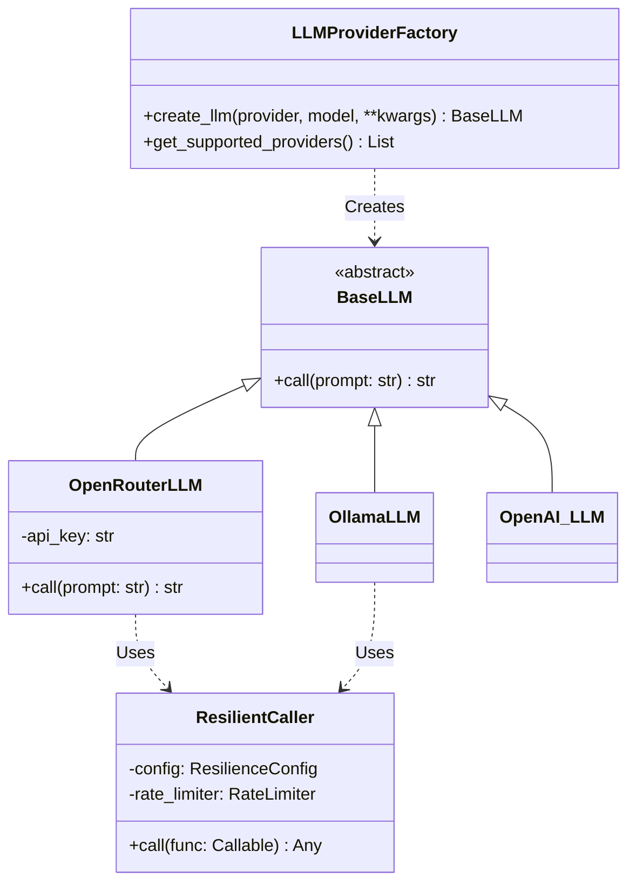
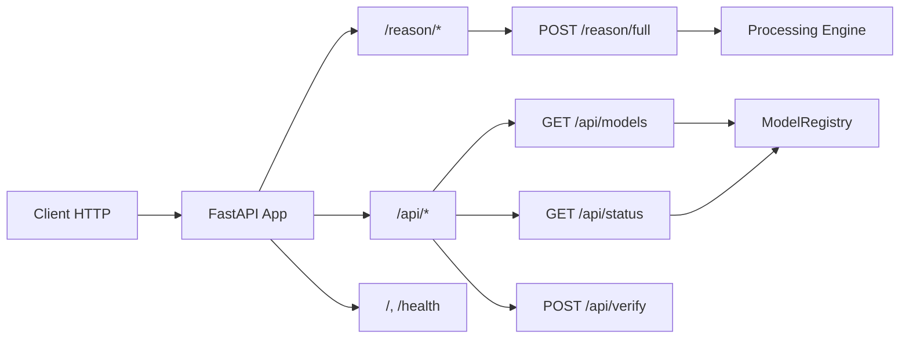

# Architecture du Projet AutoLogic

## Vue d'Ensemble

AutoLogic est un système d'agent IA implémentant le **Self-Discovery Reasoning Framework**. L'architecture est divisée en deux parties principales : un Backend Python (FastAPI) et un Frontend React.

---

## Arborescence du Projet

```
AutoLogic/
├── Cmd/                        # Scripts shell standalone
│   ├── start_backend.sh
│   ├── start_frontend.sh
│   ├── run_tests.sh
│   ├── lint.sh
│   └── generate_docs.sh
├── Code/
│   ├── Backend/
│   │   ├── Phase1-Ingestion/   # [Futur] Pipeline d'ingestion RAG
│   │   └── Phase2-Inference/   # Logique de raisonnement
│   │       └── 01_Reasoning/
│   │           └── autologic/  # Package principal
│   │               ├── core/           # Moteur, LLM, Factory, Résilience
│   │               ├── routers/        # Endpoints FastAPI
│   │               └── utils/          # Logging, helpers
│   └── Frontend/               # Application React/Vite
│       └── src/
│           ├── components/     # Composants UI
│           ├── hooks/          # Custom hooks
│           ├── services/       # Appels API
│           └── types/          # Types TypeScript
├── Config/
│   └── global.yaml             # Configuration centralisée
├── Doc/
│   ├── sphinx/                 # Documentation générée
│   ├── ARCHITECTURE.md         # Ce fichier
│   └── SETUP.md                # Guide d'installation
├── Log/                        # Fichiers de logs
├── Test/                       # Tests automatisés
├── .env                        # Variables d'environnement
├── requirements.txt            # Dépendances Python
└── start.sh                    # Script de lancement
```

---

## Architecture Backend

### Module Core & Factory Pattern

Le système utilise un **Provider Factory** pour instancier dynamiquement les modèles LLM (OpenRouter, OpenAI, Ollama, etc.) selon la configuration.



### Couche de Résilience

Chaque appel LLM est protégé par une couche de résilience configurable :

1. **Rate Limiter** : Contrôle le débit de requêtes (ex: 5 req/s).
2. **Retry Mechanism** : Réessaie automatiquement sur erreurs temporaires (429, 5xx) avec backoff exponentiel.
3. **Fallback** : Bascule automatiquement vers un modèle de secours si le principal échoue après X tentatives.

### Routers FastAPI



### Endpoints API

| Route | Méthode | Description |
|-------|---------|-------------|
| **Core** | | |
| `/reason/full` | POST | Cycle complet Self-Discover |
| `/reason/modules` | GET | Liste des 39 modules |
| **Configuration** | | |
| `/api/models` | GET | Providers et modèles disponibles |
| `/api/providers/config` | GET/PUT | Configuration active (provider, model) |
| `/api/providers/status` | GET | Vérifie la disponibilité des providers |
| `/api/providers/verify` | POST | Teste une connexion API Key spécifique |
| **Résilience** | | |
| `/api/resilience/{provider}` | GET | Config rate-limit/retry du provider |
| `/api/resilience` | PUT | Mise à jour paramètres résilience |
| **System** | | |
| `/health` | GET | Status détaillé du service |

---

## Architecture Frontend

### Stack Technique

| Technologie | Version | Rôle |
|-------------|---------|------|
| **React** | 19 | Framework UI principal |
| **Vite** | 7 | Build tool & Dev server |
| **TailwindCSS** | 4 | Styling atomique |
| **Framer Motion** | 12 | Animations et transitions |
| **TypeScript** | 5.9 | Typage statique strict |

### Composants Clés

User Interface structurée autour du composant `AutoLogicInterface` :

- **SettingsDrawer** : Panneau latéral pour la configuration dynamique.
    - Sélection Provider/Modèle
    - Gestion API Keys (stockage sécurisé local)
    - Paramètres Résilience
- **TaskInput** : Zone de saisie avec suggestion de tâches.
- **PlanDisplay** : Affichage progressif des étapes du plan.
- **SolutionDisplay** : Rendu Markdown de la réponse finale.

---

## Configuration

### global.yaml

Le fichier `Config/global.yaml` est la source de vérité pour les paramètres par défaut. Il est chargé au démarrage mais peut être surchargé dynamiquement via l'API (en mémoire).

```yaml
llm:
  resilience:
    rate_limit: 5.0
    retry_enabled: true
    fallback_enabled: true
  providers:
    openrouter: ...
    ollama: ...
```

---

## Flux de Données

1. **User** configure le provider via `SettingsDrawer` (Frontend).
2. **Frontend** envoie `PUT /api/providers/config` au Backend.
3. **Backend** met à jour le `ModelRegistry` en mémoire.
4. **User** lance une tâche.
5. **Backend** (`reasoning.py`) demande un LLM au `ProviderFactory`.
6. **Factory** crée un LLM configuré + Wrapper Résilience.
7. **Engine** exécute le cycle Self-Discover avec ce LLM.
8. **Result** est retourné au Frontend.
