# Architecture du Projet AutoLogic

## Vue d'Ensemble

AutoLogic est un système d'agent IA implémentant le **Self-Discovery Reasoning Framework**. L'architecture est divisée en deux parties principales : un Backend Python (FastAPI) et un Frontend React avec une interface glassmorphism moderne.

---

## Arborescence du Projet

```
AutoLogic/
├── Cmd/                        # Scripts shell standalone
│   ├── start_backend.sh
│   └── start_frontend.sh
├── Code/
│   ├── Backend/
│   │   ├── Phase1-Ingestion/   # [Futur] Pipeline d'ingestion RAG
│   │   └── Phase2-Inference/   # Logique de raisonnement
│   │       └── 01_Reasoning/
│   │           └── autologic/  # Package principal
│   │               ├── core/           # Moteur, LLM, modèles, résilience
│   │               ├── routers/        # Endpoints FastAPI
│   │               ├── data/           # Données statiques (modules)
│   │               └── utils/          # Logging, helpers
│   └── Frontend/               # Application React/Vite
│       └── src/
│           ├── components/     # Composants UI
│           │   ├── ui/             # Composants atomiques (Button, Input...)
│           │   ├── AutoLogicInterface.tsx
│           │   ├── SettingsDrawer.tsx
│           │   ├── Sidebar.tsx
│           │   └── ThemeProvider.tsx
│           ├── contexts/       # Contextes React (Theme)
│           ├── hooks/          # Custom hooks (useAutoLogic)
│           ├── services/       # Appels API (apiClient)
│           └── types/          # Types TypeScript
├── Config/
│   └── global.yaml             # Configuration centralisée
├── Doc/
│   ├── sphinx/                 # Documentation générée
│   ├── ARCHITECTURE.md         # Ce fichier
│   └── SETUP.md                # Guide d'installation
├── Log/                        # Fichiers de logs
├── Test/                       # Tests automatisés (pytest)
├── .env                        # Variables d'environnement
├── requirements.txt            # Dépendances Python
└── start.sh                    # Script de lancement
```

---

## Architecture Backend

### Vue d'Ensemble des Modules Core


### Modules du Package autologic/core/

| Module | Description |
|--------|-------------|
| `engine.py` | Moteur principal AutoLogicEngine avec cycle Self-Discovery |
| `llm_provider.py` | Implémentations des 5 providers LLM (OpenRouter, OpenAI, Ollama, vLLM, HuggingFace) |
| `provider_factory.py` | Factory pattern pour création dynamique de LLM |
| `model_registry.py` | Registre centralisé des modèles et configurations |
| `resilience.py` | Rate limiter, retry avec backoff, fallback intelligent |
| `models.py` | Modèles Pydantic (ReasoningModule, AdaptedModule, ReasoningPlan) |
| `prompts.py` | Templates de prompts pour chaque phase |

### Les 4 Phases du Cycle Self-Discovery

```mermaid
flowchart TB
    subgraph Phase1["🔍 PHASE 1: SELECT"]
        A[Tâche utilisateur] --> B[Analyse sémantique]
        B --> C[Sélection parmi 39 modules]
        C --> D[Modules pertinents]
    end
    
    subgraph Phase2["🔧 PHASE 2: ADAPT"]
        D --> E[Contextualisation]
        E --> F[Modules adaptés au problème]
    end
    
    subgraph Phase3["📐 PHASE 3: STRUCTURE"]
        F --> G[Ordonnancement logique]
        G --> H[Plan de raisonnement]
    end
    
    subgraph Phase4["⚡ PHASE 4: EXECUTE"]
        H --> I[Exécution pas-à-pas]
        I --> J[Synthèse finale]
        J --> K[Solution]
    end
    
    style Phase1 fill:#1a1b26,stroke:#7aa2f7
    style Phase2 fill:#1a1b26,stroke:#9ece6a
    style Phase3 fill:#1a1b26,stroke:#bb9af7
    style Phase4 fill:#1a1b26,stroke:#f7768e
```



| Phase | Modèle | Description |
|-------|--------|-------------|
| **SELECT** | Root LLM | Analyse la tâche et sélectionne les modules pertinents |
| **ADAPT** | Root LLM | Transforme les modules génériques en instructions spécifiques |
| **STRUCTURE** | Root LLM | Ordonne les modules en un plan de raisonnement cohérent |
| **EXECUTE** | Worker LLM | Suit le plan pour générer la solution finale |

### Architecture de Résilience


| Composant | Fonction |
|-----------|----------|
| **RateLimiter** | Token bucket (défaut: 5 req/s) |
| **Retry** | Backoff exponentiel sur 429/5xx (max 3 retries) |
| **Fallback** | Bascule vers modèle alternatif gratuit |

### Routers FastAPI


### Liste des Endpoints

| Route | Méthode | Handler | Description |
|-------|---------|---------|-------------|
| `/` | GET | `root()` | Health check basique |
| `/health` | GET | `health_check()` | Status détaillé |
| `/reason/full` | POST | `solve_task()` | Cycle complet Self-Discover |
| `/reason/modules` | GET | `list_modules()` | Liste des 39 modules |
| `/api/models` | GET | `list_models()` | Providers et modèles LLM |
| `/api/providers/config` | GET | `get_providers_config()` | Config active |
| `/api/providers/config` | PUT | `update_providers_config()` | Mise à jour config |
| `/api/providers/status` | GET | `get_providers_status()` | Status des providers |
| `/api/providers/{provider}/models` | GET | `get_provider_models()` | Modèles d'un provider |
| `/api/providers/verify` | POST | `verify_provider_connection()` | Test de connexion |
| `/api/providers/{provider}/resilience` | GET/PUT | Config résilience | Paramètres de résilience |

---

## Architecture Frontend

### Composants Principaux


### Composants UI

| Composant | Fichier | Description |
|-----------|---------|-------------|
| **AutoLogicInterface** | `AutoLogicInterface.tsx` | Layout principal avec sidebar et contenu |
| **SettingsDrawer** | `SettingsDrawer.tsx` | Panneau de configuration avancée |
| **Sidebar** | `Sidebar.tsx` | Navigation latérale |
| **ThemeProvider** | `ThemeProvider.tsx` | Gestion du thème (dark/light) |
| **UI Atoms** | `ui/*.tsx` | Button, Input, Slider, etc. |

### Structure des Types

```typescript
// Types principaux
interface ReasoningPlan {
  steps: ReasoningPlanStep[];
  estimated_complexity: 'low' | 'medium' | 'high';
  total_steps: number;
}

interface AutoLogicResult {
  task: string;
  plan: ReasoningPlan;
  final_output: string;
}

interface LLMConfig {
  provider: string;
  model: string;
  temperature: number;
  maxTokens: number;
  topP: number;
}

interface ResilienceConfig {
  rateLimit: number;
  retryEnabled: boolean;
  maxRetries: number;
  fallbackEnabled: boolean;
}
```

### Service API Client

Le `apiClient` centralise tous les appels backend :

```typescript
// services/api.ts
const apiClient = {
  // Raisonnement
  solveTask(task: string, config?: LLMConfig): Promise<AutoLogicResult>,
  getModules(): Promise<ReasoningModule[]>,
  
  // Configuration
  getProvidersConfig(): Promise<ProviderConfig>,
  updateProvidersConfig(config: ProviderConfig): Promise<void>,
  
  // Providers
  getProvidersStatus(): Promise<ProviderStatus[]>,
  getProviderModels(provider: string, apiKey?: string): Promise<string[]>,
  verifyConnection(provider: string, apiKey?: string): Promise<boolean>,
  
  // Résilience
  getResilienceConfig(provider: string): Promise<ResilienceConfig>,
  updateResilienceConfig(provider: string, config: ResilienceConfig): Promise<void>,
};
```

---

## Flux de Données Complet

```mermaid
sequenceDiagram
    participant U as Utilisateur
    participant F as Frontend
    participant B as Backend API
    participant E as AutoLogicEngine
    participant R as ResilientCaller
    participant L as LLM Provider
    
    U->>F: Saisit une tâche
    F->>B: POST /reason/full {task, config}
    B->>E: run_full_cycle(task)
    
    Note over E: Phase 1: SELECT
    E->>R: call(select_prompt)
    R->>R: Rate Limit Check
    R->>L: API Call
    L-->>R: Response / Error
    R->>R: Retry/Fallback if needed
    R-->>E: Modules sélectionnés
    
    Note over E: Phase 2: ADAPT
    E->>R: call(adapt_prompt)
    R->>L: API Call
    L-->>R: Response
    R-->>E: Modules adaptés
    
    Note over E: Phase 3: STRUCTURE
    E->>R: call(structure_prompt)
    R->>L: API Call
    L-->>R: Response
    R-->>E: Plan de raisonnement
    
    Note over E: Phase 4: EXECUTE
    E->>R: call(execute_prompt)
    R->>L: API Call
    L-->>R: Response
    R-->>E: Solution finale
    
    E-->>B: {task, plan, final_output}
    B-->>F: JSON Response
    F-->>U: Affiche plan + solution
```



---

## Configuration

### Variables d'Environnement

| Variable | Description | Défaut |
|----------|-------------|--------|
| `OPENROUTER_API_KEY` | Clé API OpenRouter | - |
| `OPENAI_API_KEY` | Clé API OpenAI | - |
| `OLLAMA_HOST` | URL serveur Ollama | `http://localhost:11434` |
| `HUGGINGFACE_API_KEY` | Clé API HuggingFace | - |
| `LOG_LEVEL` | Niveau de log | `INFO` |
| `CORS_ORIGINS` | Origines CORS autorisées | `http://localhost:5173` |

### global.yaml

```yaml
app:
  name: "AutoLogic"
  version: "0.2.0"
  environment: "development"

llm:
  active_provider: "openrouter"
  active_model: "google/gemini-2.0-flash-exp:free"
  temperature: 0.7
  max_tokens: 4096
  timeout: 180
  
  resilience:
    rate_limit: 5.0
    retry_enabled: true
    max_retries: 3
    retry_base_delay: 2.0
    fallback_enabled: true
  
  providers:
    openrouter:
      enabled: true
      base_url: "https://openrouter.ai/api/v1"
    openai:
      enabled: true
    ollama:
      enabled: true
      base_url: "http://localhost:11434"
    vllm:
      enabled: false
    huggingface:
      enabled: true

vector_store:
  provider: "chromadb"
  path: "./data/chroma"

logging:
  level: "INFO"
  file: "Log/backend_app.log"
```

---

## Bonnes Pratiques

### Backend
- **Typage strict** : Tous les modèles utilisent Pydantic avec validation
- **Async** : Endpoints asynchrones pour performance
- **Logging structuré** : Logs dans `Log/backend_app.log`
- **Injection de dépendances** : Via FastAPI `Depends()`
- **Factory Pattern** : Pour création dynamique de LLM
- **Résilience** : Rate limiting, retry, fallback intégrés

### Frontend
- **Composants atomiques** : UI modulaire et réutilisable
- **Custom hooks** : Logique métier isolée (`useAutoLogic`)
- **Types TypeScript** : Typage strict partagé avec le backend
- **Animations** : Framer Motion pour UX fluide
- **Design Glassmorphism** : Effets visuels modernes

### Sécurité
- **Clés API** : Stockage sécurisé via localStorage chiffré (frontend) et .env (backend)
- **CORS** : Configuration stricte des origines autorisées
- **Validation** : Pydantic pour toutes les entrées API

---

## Diagramme de Déploiement


---

*Version 0.2.0 - Janvier 2025*
