# Architecture du Projet AutoLogic

## Vue d'Ensemble

AutoLogic est un système d'agent IA implémentant le **Self-Discovery Reasoning Framework**. L'architecture est divisée en deux parties principales : un Backend Python (FastAPI) et un Frontend React.

---

## Arborescence du Projet

```
AutoLogic/
├── Cmd/                        # Scripts shell standalone
│   └── *.sh                    # (start_backend.sh, etc.)
├── Code/
│   ├── Backend/
│   │   ├── Phase1-Ingestion/   # [Futur] Pipeline d'ingestion RAG
│   │   └── Phase2-Inference/   # Logique de raisonnement
│   │       └── 01_Reasoning/
│   │           └── autologic/  # Package principal
│   │               ├── core/           # Moteur, LLM, modèles
│   │               ├── routers/        # Endpoints FastAPI
│   │               └── utils/          # Logging, helpers
│   └── Frontend/               # Application React/Vite
│       └── src/
│           ├── components/     # Composants UI
│           ├── hooks/          # Custom hooks
│           ├── services/       # Appels API
│           └── types/          # Types TypeScript
├── Config/
│   └── global.yaml             # Configuration centralisée
├── Doc/
│   ├── sphinx/                 # Documentation générée
│   ├── ARCHITECTURE.md         # Ce fichier
│   └── SETUP.md                # Guide d'installation
├── Log/                        # Fichiers de logs
├── Test/                       # Tests automatisés
├── .env                        # Variables d'environnement
├── requirements.txt            # Dépendances Python
└── start.sh                    # Script de lancement
```

---

## Architecture Backend

### Module Core

Le cœur du système est le **AutoLogicEngine** qui orchestre le cycle Self-Discovery.


### Les 4 Phases du Cycle Self-Discovery

```mermaid
flowchart TB
    subgraph Phase1["🔍 PHASE 1: SELECT"]
        A[Tâche utilisateur] --> B[Analyse sémantique]
        B --> C[Sélection parmi 39 modules]
        C --> D[Modules pertinents]
    end
    
    subgraph Phase2["🔧 PHASE 2: ADAPT"]
        D --> E[Contextualisation]
        E --> F[Modules adaptés au problème]
    end
    
    subgraph Phase3["📐 PHASE 3: STRUCTURE"]
        F --> G[Ordonnancement logique]
        G --> H[Plan de raisonnement]
    end
    
    subgraph Phase4["⚡ PHASE 4: EXECUTE"]
        H --> I[Exécution pas-à-pas]
        I --> J[Synthèse finale]
        J --> K[Solution]
    end
    
    style Phase1 fill:#1a1b26,stroke:#7aa2f7
    style Phase2 fill:#1a1b26,stroke:#9ece6a
    style Phase3 fill:#1a1b26,stroke:#bb9af7
    style Phase4 fill:#1a1b26,stroke:#f7768e
```



| Phase | Modèle | Description |
|-------|--------|-------------|
| **SELECT** | Root LLM | Analyse la tâche et sélectionne les modules pertinents |
| **ADAPT** | Root LLM | Transforme les modules génériques en instructions spécifiques |
| **STRUCTURE** | Root LLM | Ordonne les modules en un plan de raisonnement cohérent |
| **EXECUTE** | Worker LLM | Suit le plan pour générer la solution finale |

### Routers FastAPI


### Endpoints

| Route | Méthode | Handler | Description |
|-------|---------|---------|-------------|
| `/` | GET | `root()` | Health check basique |
| `/health` | GET | `health_check()` | Status détaillé |
| `/reason/full` | POST | `solve_task()` | Cycle complet Self-Discover |
| `/reason/modules` | GET | `list_modules()` | Liste des 39 modules |
| `/api/models` | GET | `list_models()` | Providers et modèles LLM |

---

## Architecture Frontend

### Composants


### Structure des Types

```typescript
// Types principaux
interface ReasoningPlan {
  steps: ReasoningPlanStep[];
  estimated_complexity: 'low' | 'medium' | 'high';
  total_steps: number;
}

interface AutoLogicResult {
  task: string;
  plan: ReasoningPlan;
  final_output: string;
}

interface LLMConfig {
  provider: string;
  model: string;
}
```

---

## Flux de Données Complet

```mermaid
sequenceDiagram
    participant U as Utilisateur
    participant F as Frontend
    participant B as Backend API
    participant E as AutoLogicEngine
    participant L as LLM Provider
    
    U->>F: Saisit une tâche
    F->>B: POST /reason/full {task, config}
    B->>E: run_full_cycle(task)
    
    Note over E: Phase 1: SELECT
    E->>L: Prompt sélection modules
    L-->>E: Modules sélectionnés
    
    Note over E: Phase 2: ADAPT
    E->>L: Prompt adaptation
    L-->>E: Modules adaptés
    
    Note over E: Phase 3: STRUCTURE
    E->>L: Prompt structuration
    L-->>E: Plan de raisonnement
    
    Note over E: Phase 4: EXECUTE
    E->>L: Prompt exécution avec plan
    L-->>E: Solution finale
    
    E-->>B: {task, plan, final_output}
    B-->>F: JSON Response
    F-->>U: Affiche plan + solution
```



---

## Configuration

### Variables d'Environnement

| Variable | Description | Défaut |
|----------|-------------|--------|
| `OPENROUTER_API_KEY` | Clé API OpenRouter | - |
| `LOG_LEVEL` | Niveau de log (DEBUG, INFO, etc.) | `INFO` |
| `CORS_ORIGINS` | Origines CORS autorisées | `http://localhost:5173` |

### global.yaml

```yaml
app:
  name: "AutoLogic"
  version: "0.1.0"

llm:
  default_provider: "openrouter"
  default_model: "google/gemini-2.0-flash-exp:free"
  temperature: 0.7
  max_tokens: 4096

vector_store:
  provider: "chromadb"
  path: "./data/chroma"
```

---

## Bonnes Pratiques

### Backend
- **Typage strict** : Tous les modèles utilisent Pydantic
- **Async** : Endpoints asynchrones pour performance
- **Logging** : Logs structurés dans `Log/backend_app.log`
- **Injection de dépendances** : Via FastAPI `Depends()`

### Frontend
- **Composants atomiques** : UI modulaire et réutilisable
- **Custom hooks** : Logique métier isolée (`useAutoLogic`)
- **Types TypeScript** : Typage strict partagé avec le backend
- **Animations** : Framer Motion pour UX fluide
