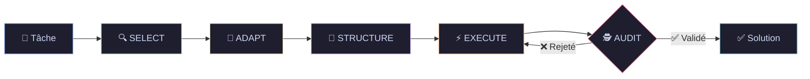

<div align="center">

# 🦖 AutoLogic

### *Système d'Agent IA avec Self-Discovery Reasoning*

[](https://python.org)
[](https://fastapi.tiangolo.com)
[](https://react.dev)
[](https://tailwindcss.com)
[](https://vite.dev)
[](#licence)

*Un framework de raisonnement intelligent qui découvre automatiquement la meilleure stratégie pour résoudre vos problèmes complexes.*

[📖 Documentation](#documentation) · [🚀 Démarrage Rapide](#démarrage-rapide) · [🏗️ Architecture](#architecture) · [🔧 API](#api-rest)

</div>

---

## 📋 Vue d'ensemble

**AutoLogic** est un système d'agent IA avancé implémentant le **Self-Discovery Reasoning Framework**. Plutôt que d'utiliser une approche de prompt unique, AutoLogic décompose automatiquement les problèmes complexes en utilisant une bibliothèque de **39 modules de raisonnement** spécialisés.

### ✨ Caractéristiques Principales

| Fonctionnalité | Description |
|----------------|-------------|
| 🧠 **Self-Discovery** | Cycle automatique en 5 phases : SELECT → ADAPT → STRUCTURE → EXECUTE → AUDIT |
| 🕵️ **Audit Layer** | Contrôle qualité continu avec boucle de feedback automatique et critères de succès |
| 🔄 **Triple Agent** | Architecture trimodale : **Strategic** (Plan), **Worker** (Execute), **Audit** (Review) |
| 📚 **39 Modules** | Bibliothèque complète de modules de raisonnement (décomposition, analogie, vérification...) |
| 🔌 **Multi-Provider** | Support OpenRouter, OpenAI, Ollama, vLLM, HuggingFace |
| 🛡️ **Résilience** | Rate limiting (5 req/s), retry avec backoff exponentiel, fallback automatique |
| 🎨 **UI Glassmorphism** | Interface moderne avec effets de verre et animations fluides |
| ⚙️ **Configurable** | YAML centralisé, panneau de paramètres dynamiques, filtres modèles |
| 🌓 **Thème Sombre/Clair** | Support complet des modes d'affichage |

---

## 🏗️ Architecture

```
AutoLogic/
├── Cmd/                    # Scripts utilitaires (.sh)
│   ├── start_backend.sh    # Lancement backend seul
│   ├── start_frontend.sh   # Lancement frontend seul
│   ├── run_tests.sh        # Exécution des tests
│   ├── lint.sh             # Vérification qualité code
│   └── generate_docs.sh    # Génération doc Sphinx
├── Code/
│   ├── Backend/
│   │   ├── Phase1-Ingestion/   # Pipeline d'ingestion RAG
│   │   │   ├── 01_DataAcquisition/
│   │   │   ├── 02_Parsing/
│   │   │   ├── 03_Chunking/
│   │   │   └── 04_Embedding/
│   │   └── Phase2-Inference/   # Moteur de raisonnement
│   │       └── 01_Reasoning/
│   │           └── autologic/
│   │               ├── core/       # Moteur, LLM, Factory, Résilience
│   │               ├── routers/    # Endpoints FastAPI
│   │               └── utils/      # Logging, helpers
│   └── Frontend/           # React 19 + Vite 7 + TailwindCSS 4
│       └── src/
│           ├── components/ # Composants UI (Header, Settings, etc.)
│           ├── hooks/      # Custom hooks (useAutoLogic)
│           ├── services/   # Client API
│           └── types/      # Types TypeScript
├── Config/                 # Configuration YAML centralisée
│   └── global.yaml         # Configuration principale
├── Doc/                    # Documentation
│   ├── ARCHITECTURE.md     # Architecture technique
│   ├── SETUP.md            # Guide d'installation détaillé
│   └── sphinx/             # Documentation Sphinx générée
├── Log/                    # Fichiers de logs
├── Test/                   # Tests automatisés (pytest)
├── .env                    # Variables d'environnement (clés API)
├── requirements.txt        # Dépendances Python
└── start.sh                # Script d'orchestration principal
```

### 🔄 Le Cycle Self-Discovery

Le cœur d'AutoLogic repose sur un cycle en **5 phases**, optimisé par une architecture **Triple Agent** :



| Phase | Rôle | LLM Utilisé | Description |
|-------|------|-------------|-------------|
| **SELECT** | Architecte | **Root Core** | Sélectionne les modules de raisonnement pertinents |
| **ADAPT** | Architecte | **Root Core** | Adapte les modules génériques au contexte de la tâche |
| **STRUCTURE** | Architecte | **Strategic** | Génère un plan de raisonnement ordonné |
| **EXECUTE** | Ouvrier | **Worker** | Exécute le plan pas-à-pas pour produire la solution finale |
| **AUDIT** | Inspecteur | **Audit** | Vérifie la qualité/complétude et demande des corrections si nécessaire |

---

## 🚀 Démarrage Rapide

### Prérequis

| Logiciel | Version Minimale | Vérification |
|----------|------------------|--------------|
| **Python** | 3.9+ | `python3 --version` |
| **Node.js** | 18+ | `node --version` |
| **npm** | 8+ | `npm --version` |
| **Git** | 2.x | `git --version` |

### Installation

```bash
# 1. Cloner le projet
git clone <url-du-repo>
cd AutoLogic

# 2. Configurer les variables d'environnement
cp .env.example .env
# Éditer .env avec votre clé API OpenRouter

# 3. Lancer le projet
./start.sh
```

Le script `start.sh` :
- ✅ Vérifie les prérequis système (Python, Node, npm)
- ✅ Crée l'environnement virtuel Python (`.venv`)
- ✅ Installe les dépendances (Backend + Frontend)
- ✅ Démarre le Backend FastAPI (port 8000)
- ✅ Démarre le Frontend Vite (port 5173)
- ✅ Ouvre automatiquement Google Chrome

Pour arrêter : `Ctrl+C`

### Configuration `.env`

```env
# ============================================
# Providers LLM
# ============================================

# OpenRouter (Provider par défaut - REQUIS)
OPENROUTER_API_KEY=sk-or-v1-xxxxx

# OpenAI (Optionnel)
OPENAI_API_KEY=sk-xxxxx

# HuggingFace (Optionnel)
HUGGINGFACE_API_KEY=hf_xxxxx

# ============================================
# Providers Locaux
# ============================================

# Ollama
OLLAMA_HOST=http://localhost:11434

# vLLM
VLLM_HOST=http://localhost:8000
VLLM_API_KEY=

# ============================================
# Application
# ============================================

LOG_LEVEL=INFO
CORS_ORIGINS=http://localhost:5173
```

---

## 🔧 API REST

### Endpoints Principaux

| Méthode | Endpoint | Description |
|---------|----------|-------------|
| `GET` | `/` | Health check basique |
| `GET` | `/health` | Health check détaillé avec version |
| `POST` | `/reason/full` | Exécute le cycle Self-Discover complet |
| `GET` | `/reason/modules` | Liste les 39 modules de raisonnement |

### Endpoints Configuration

| Méthode | Endpoint | Description |
|---------|----------|-------------|
| `GET` | `/api/models` | Liste tous les providers et modèles disponibles |
| `GET` | `/api/providers/config` | Récupère la configuration active (Root & Worker) |
| `PUT` | `/api/providers/config` | Met à jour la configuration (provider, model, température) |
| `GET` | `/api/providers/status` | Statut de disponibilité de chaque provider |
| `GET` | `/api/providers/{provider}/models` | Modèles disponibles pour un provider |
| `POST` | `/api/providers/verify` | Vérifie la connexion avec un provider |

### Endpoints Résilience

| Méthode | Endpoint | Description |
|---------|----------|-------------|
| `GET` | `/api/resilience/{provider}` | Configuration de résilience d'un provider |
| `PUT` | `/api/resilience` | Met à jour les paramètres de résilience |

### Exemple : Résoudre une tâche

```bash
curl -X POST http://localhost:8000/reason/full \
  -H "Content-Type: application/json" \
  -d '{
    "task": "Analyser les tendances de vente Q4 et proposer 3 actions stratégiques",
    "parameters": {
      "root_provider": "openrouter",
      "root_model": "meta-llama/llama-3.3-70b-instruct:free",
      "worker_provider": "openrouter",
      "worker_model": "meta-llama/llama-3.3-70b-instruct:free"
    }
  }'
```

### Réponse

```json
{
  "task": "Analyser les tendances...",
  "plan": {
    "steps": [
      {
        "step_number": 1,
        "module_id": "M01",
        "module_name": "Critical Thinking",
        "action": "Identifier les facteurs clés...",
        "expected_output": "Liste des tendances principales"
      }
    ],
    "estimated_complexity": "medium",
    "total_steps": 5
  },
  "final_output": "## Analyse des Tendances Q4\n\n..."
}
```

---

## 🔌 Providers LLM Supportés

AutoLogic supporte **5 providers LLM** avec configuration dynamique et séparation des rôles :
- **Strategic (Root)** : Planification et raisonnement complexe.
- **Worker (Tactical)** : Exécution rapide des tâches.
- **Audit (Observer)** : Vérification et critique constructive.

| Provider | Type | Modèle par défaut | Configuration |
|----------|------|-------------------|---------------|
| **OpenRouter** | Cloud | `meta-llama/llama-3.3-70b-instruct:free` | `OPENROUTER_API_KEY` |
| **OpenAI** | Cloud | `gpt-4-turbo` | `OPENAI_API_KEY` |
| **HuggingFace** | Cloud | `meta-llama/Meta-Llama-3-70B-Instruct` | `HUGGINGFACE_API_KEY` |
| **Ollama** | Local | `llama3` | `OLLAMA_HOST` |
| **vLLM** | Local | Auto-détection | `VLLM_HOST` |

### Fonctionnalités de Résilience

Le système inclut des mécanismes de résilience configurables et indépendants pour **tous les providers** (OpenRouter, OpenAI, Ollama, etc.) :

| Fonctionnalité | Description | Valeur par défaut |
|----------------|-------------|-------------------|
| **Rate Limiting** | Limite le nombre de requêtes/seconde | 5.0 req/s |
| **Retry automatique** | Retry sur erreurs 429/5xx avec backoff exponentiel | 3 tentatives |
| **Fallback** | Switch automatique vers un modèle de secours | Activé |

---

## 📚 Les 39 Modules de Raisonnement

AutoLogic utilise une bibliothèque structurée de modules :

### Catégories

| Catégorie | Modules | Exemples |
|-----------|---------|----------|
| **Analyse** | 8 | Critical Thinking, Root Cause Analysis |
| **Décomposition** | 6 | Task Decomposition, Chunking |
| **Créativité** | 5 | Brainstorming, Lateral Thinking |
| **Vérification** | 5 | Fact Checking, Consistency Check |
| **Synthèse** | 5 | Summarization, Integration |
| **Planification** | 5 | Goal Setting, Resource Allocation |
| **Autres** | 5 | Analogical Reasoning, Pattern Recognition |

---

## ⚙️ Configuration

### `Config/global.yaml`

```yaml
app:
  name: "AutoLogic"
  version: "0.1.0"
  environment: "development"
  debug: true

llm:
  # Provider et modèle actifs
  active_provider: "openrouter"
  active_model: "meta-llama/llama-3.3-70b-instruct:free"
  
  # Paramètres globaux
  temperature: 0.7
  max_tokens: 4096
  timeout: 180
  
  # Configuration de résilience
  resilience:
    rate_limit: 5.0
    retry_enabled: true
    max_retries: 3
    retry_base_delay: 2.0
    fallback_enabled: true
  
  # Configuration par provider
  providers:
    openrouter:
      enabled: true
      base_url: "https://openrouter.ai/api/v1"
      default_model: "meta-llama/llama-3.3-70b-instruct:free"
    
    ollama:
      enabled: true
      base_url: "http://localhost:11434"
      default_model: "llama3"
      auto_detect_models: true

vector_store:
  provider: "chromadb"
  path: "./data/chroma"

logging:
  level: "INFO"
  file: "Log/backend_app.log"
```

---

## 🎨 Stack Technique

### Backend

| Technologie | Version | Description |
|-------------|---------|-------------|
| **FastAPI** | ≥0.109 | Framework API moderne et performant |
| **LangChain** | ≥0.1 | Orchestration IA |
| **LangGraph** | ≥0.0.10 | Graphes de raisonnement |
| **Pydantic** | ≥2.6 | Validation de données typée |
| **ChromaDB** | ≥0.4 | Base vectorielle (futur RAG) |

### Frontend

| Technologie | Version | Description |
|-------------|---------|-------------|
| **React** | 19 | Framework UI |
| **Vite** | 7 | Build tool ultra-rapide |
| **TailwindCSS** | 4 | Styling utilitaire |
| **Framer Motion** | 12 | Animations fluides |
| **Lucide React** | 0.563 | Icônes modernes |
| **TypeScript** | 5.9 | Typage statique |

### Design

- **Glassmorphism** - Effets de transparence et flou (`backdrop-blur`, `bg-opacity`)
- **Dark Mode** - Thème sombre par défaut avec switch
- **Responsive** - Adaptatif mobile/desktop
- **Animations** - Micro-interactions fluides

---

## 🧪 Tests

```bash
# Activer l'environnement virtuel
source .venv/bin/activate

# Lancer tous les tests
pytest

# Avec couverture
pytest --cov=autologic --cov-report=html

# Tests spécifiques
pytest Test/test_provider_factory.py -v
```

### Scripts Utilitaires

```bash
# Exécuter les tests (depuis Cmd/)
./Cmd/run_tests.sh

# Vérifier la qualité du code
./Cmd/lint.sh

# Générer la documentation
./Cmd/generate_docs.sh
```

---

## 📖 Documentation

| Document | Description |
|----------|-------------|
| [📦 Guide d'Installation](Doc/SETUP.md) | Instructions pas-à-pas détaillées |
| [🏗️ Architecture Technique](Doc/ARCHITECTURE.md) | Structure, flux de données, diagrammes |
| [📚 Documentation API](Doc/sphinx/index.html) | Référence générée (après build) |

### Générer la documentation Sphinx

```bash
cd Doc/sphinx
make html
# Ouvrir _build/html/index.html
```

---

## 🔮 Roadmap

- [x] **Multi-Provider** : Support OpenRouter, OpenAI, Ollama, vLLM, HuggingFace
- [x] **Résilience** : Rate limiting, retry, fallback
- [x] **Configuration dynamique** : Panneau de paramètres frontend
- [ ] **Phase1-Ingestion** : Pipeline RAG complet
- [ ] **Historique** : Sauvegarde des sessions de raisonnement
- [ ] **Export** : PDF/Markdown des résultats
- [ ] **Docker** : Déploiement conteneurisé
- [ ] **Multi-Agent** : Agents collaboratifs avec CrewAI

---

## 🤝 Contribuer

1. Fork le projet
2. Créer une branche feature (`git checkout -b feature/AmazingFeature`)
3. Commit les changements (`git commit -m 'Add AmazingFeature'`)
4. Push sur la branche (`git push origin feature/AmazingFeature`)
5. Ouvrir une Pull Request

### Standards de code

- **Python** : PEP 8, Black, flake8, mypy
- **TypeScript** : ESLint, strict mode
- **Tests** : pytest, couverture ≥ 80%

---

## 📄 Licence

Ce projet est sous licence **MIT**. Vous êtes libre de l'utiliser, le modifier et le distribuer.

```
MIT License

Copyright (c) 2024 AutoLogic Team

Permission is hereby granted, free of charge, to any person obtaining a copy
of this software and associated documentation files (the "Software"), to deal
in the Software without restriction, including without limitation the rights
to use, copy, modify, merge, publish, distribute, sublicense, and/or sell
copies of the Software, and to permit persons to whom the Software is
furnished to do so, subject to the following conditions:

The above copyright notice and this permission notice shall be included in all
copies or substantial portions of the Software.

THE SOFTWARE IS PROVIDED "AS IS", WITHOUT WARRANTY OF ANY KIND, EXPRESS OR
IMPLIED, INCLUDING BUT NOT LIMITED TO THE WARRANTIES OF MERCHANTABILITY,
FITNESS FOR A PARTICULAR PURPOSE AND NONINFRINGEMENT.
```

---

<div align="center">

**Développé avec 🦖 par l'équipe AutoLogic**

*Framework de raisonnement IA nouvelle génération*

</div>
