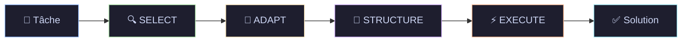

<div align="center">

# 🦖 AutoLogic

### *Système d'Agent IA avec Self-Discovery Reasoning*

[](https://python.org)
[](https://fastapi.tiangolo.com)
[](https://react.dev)
[](https://tailwindcss.com)
[](LICENSE)

*Un framework de raisonnement intelligent qui découvre automatiquement la meilleure stratégie pour résoudre vos problèmes complexes.*

[📖 Documentation](#documentation) · [🚀 Démarrage Rapide](#démarrage-rapide) · [🏗️ Architecture](#architecture) · [🔧 API](#api-rest)

</div>

---

## 📋 Vue d'ensemble

**AutoLogic** est un système d'agent IA avancé implémentant le **Self-Discovery Reasoning Framework**. Plutôt que d'utiliser une approche de prompt unique, AutoLogic décompose automatiquement les problèmes complexes en utilisant une bibliothèque de **39 modules de raisonnement** spécialisés.

### ✨ Caractéristiques Principales

| Fonctionnalité | Description |
|----------------|-------------|
| 🧠 **Self-Discovery** | Cycle automatique en 4 phases : SELECT → ADAPT → STRUCTURE → EXECUTE |
| 📚 **39 Modules** | Bibliothèque complète de modules de raisonnement (décomposition, analogie, vérification...) |
| 🔌 **Multi-Provider** | Support OpenRouter, Ollama, vLLM et autres providers LLM |
| 🎨 **UI Glassmorphism** | Interface moderne avec effets de verre et animations fluides |
| ⚙️ **Configurable** | YAML centralisé pour une personnalisation complète |

---

## 🏗️ Architecture

```
AutoLogic/
├── Cmd/                    # Scripts utilitaires (.sh)
├── Code/
│   ├── Backend/
│   │   ├── Phase1-Ingestion/   # (Futur) Pipeline d'ingestion RAG
│   │   └── Phase2-Inference/   # Moteur de raisonnement
│   │       └── 01_Reasoning/
│   │           └── autologic/
│   │               ├── core/       # Moteur, LLM, prompts
│   │               ├── routers/    # Endpoints FastAPI
│   │               └── utils/      # Logging, helpers
│   └── Frontend/           # React + Vite + TailwindCSS
├── Config/                 # Configuration YAML centralisée
├── Doc/                    # Documentation (Sphinx, Markdown)
├── Log/                    # Fichiers de logs
├── Test/                   # Tests automatisés
└── start.sh               # Script d'orchestration
```

### 🔄 Le Cycle Self-Discovery

Le cœur d'AutoLogic repose sur un cycle en **4 phases** :



| Phase | Description |
|-------|-------------|
| **SELECT** | Sélectionne les modules de raisonnement pertinents parmi les 39 disponibles |
| **ADAPT** | Adapte les modules génériques au contexte spécifique de la tâche |
| **STRUCTURE** | Génère un plan de raisonnement ordonné avec étapes numérotées |
| **EXECUTE** | Exécute le plan pas-à-pas pour produire la solution finale |

---

## 🚀 Démarrage Rapide

### Prérequis

- **Python** 3.9 ou supérieur
- **Node.js** 18 ou supérieur
- **Git**

### Installation

```bash
# 1. Cloner le projet
git clone <url-du-repo>
cd AutoLogic

# 2. Configurer les variables d'environnement
cp .env.example .env
# Éditer .env avec votre clé API OpenRouter

# 3. Lancer le projet
./start.sh
```

Le script `start.sh` :
- ✅ Vérifie les prérequis système
- ✅ Crée l'environnement virtuel Python
- ✅ Installe les dépendances (Backend + Frontend)
- ✅ Démarre le Backend FastAPI (port 8000)
- ✅ Démarre le Frontend Vite (port 5173)
- ✅ Ouvre automatiquement le navigateur

### Configuration `.env`

```env
# Provider LLM par défaut
OPENROUTER_API_KEY=sk-or-v1-xxxxx

# Optionnel : Logging
LOG_LEVEL=INFO

# Optionnel : CORS (séparés par virgule)
CORS_ORIGINS=http://localhost:5173
```

---

## 🔧 API REST

### Endpoints

| Méthode | Endpoint | Description |
|---------|----------|-------------|
| `GET` | `/` | Health check basique |
| `GET` | `/health` | Health check détaillé avec version |
| `POST` | `/reason/full` | Exécute le cycle Self-Discover complet |
| `GET` | `/reason/modules` | Liste les 39 modules de raisonnement |
| `GET` | `/api/models` | Liste les providers et modèles disponibles |

### Exemple : Résoudre une tâche

```bash
curl -X POST http://localhost:8000/reason/full \
  -H "Content-Type: application/json" \
  -d '{
    "task": "Analyser les tendances de vente Q4 et proposer 3 actions stratégiques",
    "parameters": {
      "provider": "openrouter",
      "model": "google/gemini-2.0-flash-exp:free"
    }
  }'
```

### Réponse

```json
{
  "task": "Analyser les tendances...",
  "plan": {
    "steps": [
      {
        "step_number": 1,
        "module_id": "M01",
        "module_name": "Critical Thinking",
        "action": "Identifier les facteurs clés...",
        "expected_output": "Liste des tendances principales"
      }
    ],
    "estimated_complexity": "medium",
    "total_steps": 5
  },
  "final_output": "## Analyse des Tendances Q4\n\n..."
}
```

---

## 📚 Les 39 Modules de Raisonnement

AutoLogic utilise une bibliothèque structurée de modules :

### Catégories

| Catégorie | Modules | Exemples |
|-----------|---------|----------|
| **Analyse** | 8 | Critical Thinking, Root Cause Analysis |
| **Décomposition** | 6 | Task Decomposition, Chunking |
| **Créativité** | 5 | Brainstorming, Lateral Thinking |
| **Vérification** | 5 | Fact Checking, Consistency Check |
| **Synthèse** | 5 | Summarization, Integration |
| **Planification** | 5 | Goal Setting, Resource Allocation |
| **Autres** | 5 | Analogical Reasoning, Pattern Recognition |

---

## ⚙️ Configuration

### `Config/global.yaml`

```yaml
app:
  name: "AutoLogic"
  version: "0.1.0"
  environment: "development"

llm:
  default_provider: "openrouter"
  default_model: "google/gemini-2.0-flash-exp:free"
  temperature: 0.7
  max_tokens: 4096

vector_store:
  provider: "chromadb"
  path: "./data/chroma"

logging:
  level: "INFO"
  file: "Log/backend_app.log"
```

---

## 🎨 Stack Technique

### Backend
- **FastAPI** - Framework API moderne et performant
- **LangChain** / **LangGraph** - Orchestration IA
- **Pydantic** - Validation de données typée
- **ChromaDB** - Base vectorielle (futur RAG)

### Frontend
- **React 19** - Framework UI
- **Vite 7** - Build tool ultra-rapide
- **TailwindCSS 4** - Styling utilitaire
- **Framer Motion** - Animations fluides
- **Lucide React** - Icônes modernes

### Design
- **Glassmorphism** - Effets de transparence et flou
- **Dark Mode** - Thème sombre par défaut
- **Responsive** - Adaptatif mobile/desktop

---

## 📖 Documentation

| Document | Description |
|----------|-------------|
| [📦 Guide d'Installation](Doc/SETUP.md) | Instructions pas-à-pas |
| [🏗️ Architecture Technique](Doc/ARCHITECTURE.md) | Structure et flux de données |
| [📚 Documentation API](Doc/sphinx/index.html) | Référence générée (après build) |

### Générer la documentation Sphinx

```bash
cd Doc/sphinx
make html
# Ouvrir _build/html/index.html
```

---

## 🧪 Tests

```bash
# Activer l'environnement virtuel
source .venv/bin/activate

# Lancer tous les tests
pytest

# Avec couverture
pytest --cov=autologic --cov-report=html
```

---

## 🔮 Roadmap

- [ ] **Phase1-Ingestion** : Pipeline RAG complet
- [ ] **Multi-LLM** : Routing dynamique entre providers
- [ ] **Historique** : Sauvegarde des sessions de raisonnement
- [ ] **Export** : PDF/Markdown des résultats
- [ ] **Docker** : Déploiement conteneurisé

---

## 📄 Licence

[MIT License](LICENSE)

---

<div align="center">

**Développé avec 🦖 par l'équipe AutoLogic**

</div>
