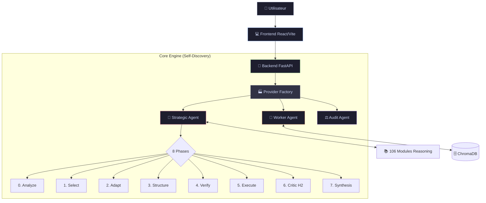

<div align="center">

# 🦖 AutoLogic
### *Next-Gen Autonomous Reasoning Engine*

[](https://python.org)
[](https://fastapi.tiangolo.com)
[](https://react.dev)
[](https://tailwindcss.com)
[](https://vite.dev)
[](LICENSE)

*Un système d'agent IA autonome implémentant le framework **Self-Discover**.  
Découvre, Adapte et Exécute des stratégies complexes pour résoudre n'importe quelle tâche via un cycle cognitif en 8 étapes.*

[📖 Documentation](Doc/sphinx/index.rst) · [🚀 Démarrage](start.sh) · [🐛 Signaler un Bug](https://github.com/votre-repo/issues) · [✨ Fonctionnalités](#-fonctionnalités-clés)

</div>

---

## 📚 Table des Matières

- [🔮 À Propos](#-à-propos)
- [📖 Références Scientifiques](#-références-scientifiques)
- [✨ Fonctionnalités Clés](#-fonctionnalités-clés)
- [🏗️ Architecture Système](#️-architecture-système)
- [📂 Structure du Projet](#-structure-du-projet)
- [🔄 Phase 1 : Pipeline RAG (Ingestion)](#-phase-1--pipeline-rag-ingestion)
  - [Étape 1.1 : Acquisition des Données](#étape-11--acquisition-des-données-01_dataacquisition)
  - [Étape 1.2 : Parsing et Nettoyage](#étape-12--parsing-et-nettoyage-02_parsing)
  - [Étape 1.3 : Chunking Sémantique](#étape-13--chunking-sémantique-03_chunking)
  - [Étape 1.4 : Génération des Embeddings](#étape-14--génération-des-embeddings-04_embedding)
- [🧠 Phase 2 : Cycle Self-Discovery (Inférence)](#-phase-2--cycle-self-discovery-inférence)
  - [Phase 0 : Analyze (Analyse Initiale)](#phase-0--analyze-analyse-initiale)
  - [Phase 1 : Select (Sélection)](#phase-1--select-sélection)
  - [Phase 2 : Adapt (Adaptation)](#phase-2--adapt-adaptation)
  - [Phase 3 : Structure (Structuration)](#phase-3--structure-structuration)
  - [Phase 4 : Verify (Vérification)](#phase-4--verify-vérification)
  - [Phase 5 : Execute (Exécution)](#phase-5--execute-exécution)
  - [Phase 6 : Critic H2 (Critique)](#phase-6--critic-h2-critique)
  - [Phase 7 : Synthesis & Audit (Synthèse)](#phase-7--synthesis--audit-synthèse)
- [📊 Les 106 Modules de Raisonnement](#-les-106-modules-de-raisonnement)
- [🚀 Démarrage Rapide](#-démarrage-rapide)
- [🛠️ Stack Technique](#️-stack-technique)
- [🤝 Contribuer](#-contribuer)

---

## 🔮 À Propos

**AutoLogic** n'est pas un simple chatbot. C'est un **moteur d'inférence cognitif** conçu pour simuler un raisonnement humain de haut niveau.

Contrairement aux approches traditionnelles (Chain-of-Thought), AutoLogic utilise une **bibliothèque de 106 modules de raisonnement** (Pensée Critique, Analyse Systémique, Raisonnement Bayésien...) qu'il sélectionne et assemble dynamiquement pour créer une structure de résolution sur-mesure pour chaque problème.

L'intelligence du système repose sur trois piliers fondamentaux :

1. **Découverte Autonome** : Le système identifie automatiquement les stratégies cognitives les plus adaptées au problème posé
2. **Adaptation Contextuelle** : Chaque module abstrait est reformulé en instructions spécifiques au contexte
3. **Validation Multi-Niveau** : Un système de critique (H2) et d'audit garantit la qualité des réponses

L'interface utilisateur reflète cette intelligence avec un design **"Liquid Glass"** immersif, offrant une transparence totale sur le processus de pensée de l'IA.

---

## 📖 Références Scientifiques

AutoLogic implémente le framework **Self-Discover** présenté dans la recherche de Google DeepMind.

### Article Principal

> **SELF-DISCOVER: Large Language Models Self-Compose Reasoning Structures**  
> *Zhou, P., Pujara, J., Ren, X., Chen, X., Cheng, H.-T., Le, Q. V., Chi, E. H., Zhou, D., Mishra, S., & Zheng, H. S.*  
> arXiv:2402.03620, Février 2024  
> 🔗 [https://arxiv.org/abs/2402.03620](https://arxiv.org/abs/2402.03620)

### Résultats Clés du Paper

| Benchmark | Amélioration vs CoT | Notes |
|:---|:---:|:---|
| BigBench-Hard | **+32%** | Tâches de raisonnement difficiles |
| MATH | Significative | Problèmes mathématiques complexes |
| Grounded Agent Reasoning | Significative | Agents ancrés dans le monde réel |

### Concepts Fondamentaux

Le framework Self-Discover introduit les concepts suivants utilisés dans AutoLogic :

- **Atomic Reasoning Modules** : Unités fondamentales de raisonnement (ex: "décomposition en sous-tâches", "pensée critique")
- **Task-Intrinsic Structures** : Structures de raisonnement adaptées spécifiquement à chaque tâche
- **Compositional Reasoning** : Assemblage dynamique de modules pour former une stratégie cohérente
- **Cross-Model Transferability** : Les structures découvertes sont universellement applicables

### Efficacité Computationnelle

> [!TIP]
> Self-Discover nécessite **10 à 40 fois moins de calculs** que Chain-of-Thought Self-Consistency tout en obtenant de meilleures performances.

---

## ✨ Fonctionnalités Clés

| Pillier | Description |
| :--- | :--- |
| **🧠 Self-Discovery** | Cycle cognitif complet en 8 étapes : *Analyze* → *Select* → *Adapt* → *Structure* → *Verify* → *Execute* → *Critic* → *Synthesis/Audit*. |
| **🎨 Liquid UI** | Interface React/Tailwind ultra-moderne avec effets de verre (Glassmorphism) et animations fluides (Framer Motion). |
| **🛡️ Résilience** | Architecture robuste avec Rate Limiting, Backoff Exponentiel, Smart Fallbacks et validation heuristique H2. |
| **🔌 Multi-Provider** | Compatible OpenRouter, OpenAI, HuggingFace, Anthropic, Cohere et modèles locaux (Ollama). |
| **🕵️ Triple Agent** | Orchestration dynamique entre **Strategic** (Planification), **Worker** (Exécution) et **Audit** (Validation). |
| **📚 RAG Avancé** | Pipeline d'ingestion modulaire (Acquisition, Parsing, Chunking, Embedding) avec stockage vectoriel ChromaDB. |

---

## 🏗️ Architecture Système

Le projet suit une structure rigoureuse "Artifact-First" pour garantir maintenabilité et scalabilité.



---

## 📂 Structure du Projet

AutoLogic suit une organisation rigoureuse pour séparer les responsabilités :

```
AutoLogic/
├── Cmd/                    # Scripts standalone (start.sh, ingestion)
├── Code/
│   ├── Backend/
│   │   ├── Phase1-Ingestion/    # Pipeline RAG (4 étapes)
│   │   │   ├── 01_DataAcquisition/
│   │   │   ├── 02_Parsing/
│   │   │   ├── 03_Chunking/
│   │   │   └── 04_Embedding/
│   │   └── Phase2-Inference/    # Moteur Self-Discovery
│   │       └── 01_Reasoning/
│   │           └── autologic/
│   │               ├── core/    # Engine, models, prompts, critic
│   │               ├── data/    # 106 modules JSON
│   │               └── utils/   # Logging, resilience
│   └── Frontend/           # Interface React (Vite + Tailwind)
├── Config/                 # Paramètres globaux (global.yaml)
├── Doc/                    # Documentation Sphinx
├── Log/                    # Traces d'exécution
└── Test/                   # Suite Pytest
```

---

## 🔄 Phase 1 : Pipeline RAG (Ingestion)

Avant de pouvoir raisonner, AutoLogic ingère et structure la connaissance via un pipeline modulaire en 4 étapes séquentielles.


### Étape 1.1 : Acquisition des Données (`01_DataAcquisition/`)

**Objectif** : Collecter les données brutes depuis diverses sources hétérogènes.

**Fonctionnalités détaillées** :
- **Connecteurs multi-sources** : APIs REST/GraphQL, bases de données (PostgreSQL, MongoDB), systèmes de fichiers locaux/distants (S3, GCS)
- **Gestion des authentifications** : OAuth 2.0, API Keys, tokens JWT
- **Téléchargement incrémental** : Suivi des versions, détection des modifications (ETag, Last-Modified)
- **Support des formats d'entrée** : PDF, DOCX, HTML, Markdown, CSV, JSON, XML
- **Rate limiting intelligent** : Respect des quotas API avec exponential backoff
- **Logging et traçabilité** : Journalisation complète des opérations pour audit

**Flux de données** :
1. Configuration des sources via `global.yaml`
2. Authentification et établissement des connexions
3. Récupération des documents avec gestion des erreurs
4. Stockage temporaire des données brutes
5. Génération des métadonnées (source, date, hash)

---

### Étape 1.2 : Parsing et Nettoyage (`02_Parsing/`)

**Objectif** : Transformer les documents bruts en texte structuré et normalisé.

**Fonctionnalités détaillées** :
- **Extraction de contenu** :
  - PDF : OCR intégré (Tesseract), extraction de tableaux, gestion des pages scannées
  - DOCX : Préservation de la structure (titres, listes, tableaux)
  - HTML : Nettoyage des balises, extraction du contenu principal (boilerplate removal)
  - Images : Description via modèle vision (optionnel)
  
- **Nettoyage avancé** :
  - Suppression des caractères spéciaux et encodages incorrects
  - Normalisation Unicode (NFC)
  - Correction des sauts de ligne et espaces multiples
  - Détection et correction de la langue
  
- **Enrichissement des métadonnées** :
  - Extraction automatique : titre, auteur, date de création
  - Classification du type de document
  - Détection de la langue principale

**Output** : Documents Markdown structurés avec métadonnées JSON associées.

---

### Étape 1.3 : Chunking Sémantique (`03_Chunking/`)

**Objectif** : Découper les documents en segments cohérents optimisés pour la recherche vectorielle.

**Stratégies de découpage** :

| Stratégie | Description | Cas d'usage |
|:---|:---|:---|
| **Fixed Size** | Chunks de taille fixe (ex: 512 tokens) | Documents homogènes |
| **Semantic** | Découpage basé sur les frontières sémantiques | Documents structurés |
| **Recursive** | Découpage hiérarchique (paragraphes → phrases) | Longs documents |
| **Sentence** | Regroupement par phrases complètes | Textes narratifs |

**Paramètres clés** :
- **chunk_size** : Taille cible (défaut: 512 tokens)
- **chunk_overlap** : Chevauchement pour préserver le contexte (défaut: 50 tokens)
- **separators** : Délimiteurs personnalisés (`\n\n`, `\n`, `. `, etc.)

**Préservation du contexte** :
- Ajout d'un préfixe avec le titre/section parent
- Liens vers les chunks adjacents
- Conservation des métadonnées du document source

---

### Étape 1.4 : Génération des Embeddings (`04_Embedding/`)

**Objectif** : Convertir les chunks textuels en vecteurs denses pour la recherche sémantique.

**Modèles d'embedding supportés** :

| Modèle | Dimensions | Avantages |
|:---|:---:|:---|
| OpenAI `text-embedding-3-small` | 1536 | Haute qualité, multilingue |
| OpenAI `text-embedding-3-large` | 3072 | Performance maximale |
| HuggingFace `sentence-transformers` | Variable | Open-source, local |
| Cohere `embed-multilingual-v3` | 1024 | Excellent multilingue |

**Processus** :
1. Batching des chunks pour optimiser les appels API
2. Génération des vecteurs avec retry automatique
3. Normalisation L2 des vecteurs
4. Stockage dans ChromaDB avec métadonnées

**Stockage vectoriel (ChromaDB)** :
- Indexation HNSW pour recherche rapide
- Persistance sur disque
- Support du filtrage par métadonnées
- API de requête unifiée

---

## 🧠 Phase 2 : Cycle Self-Discovery (Inférence)

Le cœur du système repose sur un cycle cognitif en **8 phases** orchestré par trois agents spécialisés.

### Architecture Triple Agent

```mermaid
sequenceDiagram
    participant U as 👤 User
    participant S as 🧠 Strategic (Root)
    participant W as 🔨 Worker
    participant C as ⚖️ Critic/Audit
    participant DB as 🗄️ Memory/RAG

    U->>S: 1. Nouvelle Tâche
    Note over S: Analyse Intention & Contraintes
    
    rect rgb(30, 30, 46)
        Note right of S: Cycle Self-Discovery
        S->>S: SELECT Modules (Library)
        S->>S: ADAPT Modules (Context)
        S->>S: STRUCTURE Plan
    end

    S->>C: 2. Verify Plan
    
    alt Plan Invalid
        C-->>S: ❌ Reject (Feedback)
        S->>S: Refine Plan (Loop)
    else Plan Valid
        C-->>W: ✅ Approve Execution
    end
    
    loop Execution Step-by-Step
        W->>DB: Query Context
        DB-->>W: Relevant Chunks
        W->>W: Execute Step
        W->>C: Intermediate Result
        C-->>W: Validation (H2 Critic)
    end
    
    W->>S: Execution Trace
    S->>C: Final Synthesis Request
    C->>U: 🏁 Réponse Finale Auditée
```



---

### Phase 0 : Analyze (Analyse Initiale)

**Rôle** : Comprendre profondément la tâche avant toute action.

**Processus détaillé** :
1. **Extraction de l'intention** : Identification de l'objectif principal de l'utilisateur
2. **Détection des contraintes** : Limitations explicites et implicites (temps, format, style)
3. **Analyse du domaine** : Classification du type de problème (technique, créatif, analytique)
4. **Évaluation de la complexité** : Estimation de la profondeur de raisonnement requise
5. **Identification des ambiguïtés** : Points nécessitant clarification potentielle

**Output** : Objet JSON structuré contenant :
- `intent` : Intention principale identifiée
- `constraints` : Liste des contraintes détectées
- `domain` : Domaine de connaissance principal
- `complexity_estimate` : Niveau de complexité (low/medium/high)
- `ambiguities` : Points potentiellement ambigus

---

### Phase 1 : Select (Sélection)

**Rôle** : Choisir les modules de raisonnement les plus pertinents parmi les 106 disponibles.

**Mécanisme de sélection** :
1. Le **Strategic Agent** reçoit la bibliothèque complète des 106 modules
2. Analyse de la correspondance entre chaque module et la tâche
3. Scoring basé sur :
   - Pertinence directe avec le problème
   - Complémentarité avec d'autres modules sélectionnés
   - Couverture des différents aspects de la tâche
4. Sélection des 5-15 modules les plus adaptés

**Critères de sélection** :
| Critère | Poids | Description |
|:---|:---:|:---|
| Pertinence | 40% | Alignement direct avec la tâche |
| Complémentarité | 30% | Couverture de perspectives différentes |
| Faisabilité | 20% | Applicabilité pratique |
| Efficience | 10% | Rapport coût/bénéfice cognitif |

**Output** : Liste ordonnée des modules sélectionnés avec justification.

---

### Phase 2 : Adapt (Adaptation)

**Rôle** : Personnaliser chaque module générique au contexte spécifique de la tâche.

**Transformation** :
Pour chaque module sélectionné :
1. **Reformulation** : La description abstraite devient une instruction concrète
2. **Contextualisation** : Intégration des éléments spécifiques de la tâche
3. **Opérationnalisation** : Définition d'actions spécifiques à exécuter

**Exemple de transformation** :

| Module Générique | Adaptation Contextuelle |
|:---|:---|
| *"Décomposer le problème en sous-problèmes"* | *"Identifier les 3 composants techniques (frontend, API, database) et leurs interdépendances"* |
| *"Analyser les biais cognitifs"* | *"Vérifier si la solution proposée favorise une technologie par familiarité plutôt que par mérite technique"* |

**Output** : Liste de `AdaptedModule` contenant :
- `base` : Référence au module original
- `adapted_description` : Description contextuelle
- `specific_actions` : Actions concrètes à effectuer

---

### Phase 3 : Structure (Structuration)

**Rôle** : Assembler les modules adaptés en un plan d'exécution cohérent et ordonné.

**Construction du plan** :
1. **Ordonnancement logique** : Définition de l'ordre d'exécution optimal
2. **Création des dépendances** : Identification des prérequis entre étapes
3. **Estimation des ressources** : Temps et effort estimés par étape
4. **Définition des jalons** : Points de validation intermédiaires

**Structure du `ReasoningPlan`** :
```
ReasoningPlan
├── goal: str                    # Objectif final reformulé
├── complexity: str              # low | medium | high | expert
├── steps: List[PlanStep]
│   ├── step_number: int
│   ├── module_id: str
│   ├── action: str              # Action concrète
│   ├── expected_output: str     # Résultat attendu
│   └── dependencies: List[int]  # Étapes prérequises
└── success_criteria: List[str]  # Critères de succès mesurables
```

**Output** : Plan structuré prêt pour validation et exécution.

---

### Phase 4 : Verify (Vérification)

**Rôle** : Valider la cohérence et la complétude du plan avant exécution.

**Vérifications effectuées** :

| Check | Description | Action si Échec |
|:---|:---|:---|
| **Couverture** | Toutes les contraintes sont adressées | Retour Phase 1 |
| **Cohérence** | Pas de contradictions entre étapes | Retour Phase 3 |
| **Faisabilité** | Chaque étape est réalisable | Simplification |
| **Complétude** | Aucune étape critique manquante | Enrichissement |
| **Ordre** | Pas de dépendances circulaires | Réordonnancement |

**Double-Backtrack** :
Si le plan est rejeté, le système peut :
1. **Backtrack Phase 3** : Restructurer le plan (feedback mineur)
2. **Backtrack Phase 1** : Re-sélectionner des modules (feedback majeur)

**Output** : Validation booléenne avec feedback détaillé si rejet.

---

### Phase 5 : Execute (Exécution)

**Rôle** : Exécuter le plan étape par étape via le Worker Agent.

**Processus d'exécution** :
1. **Récupération du contexte** : Requête RAG pour obtenir les informations pertinentes
2. **Exécution séquentielle** : Traitement de chaque étape du plan
3. **Accumulation des résultats** : Construction progressive de la réponse
4. **Gestion des erreurs** : Retry avec adaptation si échec d'une étape

**Caractéristiques du Worker Agent** :
- Utilise un modèle plus rapide et économique (ex: GPT-4o-mini, Llama 3)
- Spécialisé dans l'exécution plutôt que la planification
- Accès direct à la base vectorielle pour le contexte
- Feedback en temps réel sur la progression

**Output** : Réponse brute complète issue de l'exécution du plan.

---

### Phase 6 : Critic H2 (Critique)

**Rôle** : Évaluer la qualité de l'exécution selon l'heuristique H2.

**Heuristique H2 (Hierarchical Holistic)** :

L'évaluation se fait selon 4 dimensions :

| Dimension | Poids | Critères |
|:---|:---:|:---|
| **Complétude** | 30% | Toutes les étapes du plan sont traitées |
| **Cohérence** | 30% | Pas de contradictions dans la réponse |
| **Pertinence** | 25% | Adéquation avec la tâche originale |
| **Qualité** | 15% | Clarté, structure, utilité pratique |

**Scoring** :
- **Score ≥ 0.8** : Validation → passage à la Synthèse
- **Score < 0.8** : Rejet → feedback + nouvelle tentative

**Mécanisme de feedback** :
Le Critic génère un feedback structuré :
- Points forts identifiés
- Lacunes critiques
- Instructions de correction prioritaires
- Suggestion de re-planification si nécessaire

**Output** : Score numérique [0-1] + feedback actionnable.

---

### Phase 7 : Synthesis & Audit (Synthèse)

**Rôle** : Produire la réponse finale polie et auditée.

**Sous-phases** :

#### 7a. Synthèse (Strategic Model)
1. Reformulation de la réponse brute en format utilisateur
2. Structuration claire (sections, listes, exemples)
3. Suppression des redondances
4. Ajout de conclusions et recommandations

#### 7b. Audit Itératif (Audit Model)
Boucle de validation time-boxée :

```
WHILE (not timeout AND iterations < max)
    1. Évaluer suffisance structurelle (score /100)
    2. SI score >= 90% OR changements mineurs → VALIDER
    3. SINON identifier éléments manquants critiques
    4. Raffiner la réponse (via Strategic Model)
    5. iterations++
END
```

**Paramètres de l'audit** :
- `audit_timeout` : Durée maximale (défaut: 30s)
- `audit_max_retries` : Nombre max d'itérations (défaut: 3)
- `structural_sufficiency_threshold` : Seuil de validation (défaut: 90%)

**Output final** : Réponse polie, validée et prête pour l'utilisateur.

---

## 📊 Les 106 Modules de Raisonnement

AutoLogic tire sa puissance d'une bibliothèque exhaustive de **106 modules cognitifs** organisés en **15 catégories**. Lors de la phase de Sélection, l'agent Strategic choisit les modules les plus adaptés à la problématique.

### Vue d'ensemble par catégorie

| # | Catégorie | Nb Modules | Focus |
|:---:|:---|:---:|:---|
| 1 | Décomposition du problème | 4 | Analyse granulaire |
| 2 | Pensée critique | 6 | Évaluation et risques |
| 3 | Pensée créative | 5 | Innovation et perspectives |
| 4 | Pensée analytique | 5 | Logique et données |
| 5 | Pensée systémique | 4 | Vision d'ensemble |
| 6 | Prise de décision | 6 | Choix et compromis |
| 7 | Collaboration | 3 | Consensus et communication |
| 8 | Vérification | 4 | Tests et cohérence |
| 9 | Exécution | 2 | Progression et suivi |
| 10 | Raisonnement modal et intensionnel | 7 | Possibilités et nécessités |
| 11 | Raisonnement abductif et génératif | 7 | Hypothèses et analogies |
| 12 | Raisonnement multi-niveau | 8 | Abstraction et composition |
| 13 | Raisonnement bayésien et probabiliste | 7 | Probabilités et incertitude |
| 14 | Métacognition et contrôle exécutif | 8 | Auto-monitoring |
| 15 | Raisonnement symbolique et formel | 8 | Logique formelle |
| 16 | Raisonnement domaine-spécifique | 7 | Expertises ciblées |
| 17 | Raisonnement visuel et multimodal | 7 | Spatial et diagrammatique |
| 18 | Raisonnement itératif et réflexif | 8 | Raffinement et feedback |

---

### Liste Complète des 106 Modules

#### 1. Décomposition du problème (4 modules)

| ID | Nom | Question Clé |
|:---|:---|:---|
| `decomposer_le_probleme` | Décomposer le problème | Comment puis-je décomposer ce problème en sous-problèmes plus petits et gérables ? |
| `identifier_les_contraintes` | Identifier les contraintes | Quelles sont toutes les contraintes et limitations de ce problème ? |
| `identifier_les_inputs_et_outputs` | Identifier les inputs et outputs | Quels sont les inputs, outputs et ressources nécessaires ? |
| `clarifier_les_objectifs` | Clarifier les objectifs | Quel est l'objectif exact ? Comment mesurer le succès ? |

---

#### 2. Pensée critique (6 modules)

| ID | Nom | Question Clé |
|:---|:---|:---|
| `identifier_les_hypotheses` | Identifier les hypothèses | Quelles hypothèses implicites ou explicites sous-tendent ce problème ? |
| `avaluer_les_risques` | Évaluer les risques | Quels sont les risques potentiels et comment les mitiger ? |
| `analyser_les_biais` | Analyser les biais | Quels biais cognitifs pourraient affecter mon raisonnement ? |
| `avaluer_les_consaquences` | Évaluer les conséquences | Quelles sont les conséquences à court et long terme de chaque solution ? |
| `simplifier_le_probleme` | Simplifier le problème | Puis-je simplifier ce problème tout en préservant son essence ? |
| `avaluer_de_mania_re_critique` | Évaluer de manière critique | Comment évaluer critiquement la validité et la fiabilité des informations ? |

---

#### 3. Pensée créative (5 modules)

| ID | Nom | Question Clé |
|:---|:---|:---|
| `brainstorming` | Brainstorming | Quelles sont toutes les solutions possibles sans jugement préalable ? |
| `penser_hors_des_sentiers_battus` | Penser hors des sentiers battus | Comment aborder ce problème d'une manière non conventionnelle ? |
| `utiliser_la_pensee_systemique` | Utiliser la pensée systémique | Comment ce problème s'inscrit-il dans un système plus large ? |
| `analyser_les_risques_et_opportunites` | Analyser les risques et opportunités | Quelles opportunités cachées ce problème révèle-t-il ? |
| `utiliser_la_pensee_reflexive` | Utiliser la pensée réflexive | Comment mes expériences passées peuvent-elles éclairer ce problème ? |

---

#### 4. Pensée analytique (5 modules)

| ID | Nom | Question Clé |
|:---|:---|:---|
| `analyser_cause_effet` | Analyser cause-effet | Quelles sont les relations de cause à effet dans ce problème ? |
| `utiliser_la_pensae_inductive` | Utiliser la pensée inductive | Puis-je identifier des patterns à partir d'exemples spécifiques ? |
| `utiliser_la_pensee_deductive` | Utiliser la pensée déductive | Quelles conclusions logiques puis-je déduire des prémisses ? |
| `prioriser_les_alaments` | Prioriser les éléments | Quels sont les éléments les plus importants à traiter en premier ? |
| `identifier_les_donnees_pertinentes` | Identifier les données pertinentes | Quelles données sont essentielles pour résoudre ce problème ? |

---

#### 5. Pensée systémique (4 modules)

| ID | Nom | Question Clé |
|:---|:---|:---|
| `identifier_les_parties_prenantes` | Identifier les parties prenantes | Qui sont toutes les parties prenantes affectées par ce problème ? |
| `analyser_les_dependances` | Analyser les dépendances | Quelles sont les dépendances entre les différents éléments du système ? |
| `identifier_les_effets_de_second_ordre` | Identifier les effets de second ordre | Quels sont les effets indirects de mes actions ? |
| `utiliser_la_pensee_holistique` | Utiliser la pensée holistique | Comment voir le problème dans son ensemble plutôt que par parties isolées ? |

---

#### 6. Prise de décision (6 modules)

| ID | Nom | Question Clé |
|:---|:---|:---|
| `definir_les_criteres_de_decision` | Définir les critères de décision | Quels sont les critères pour évaluer et comparer les solutions ? |
| `peser_les_alternatives` | Peser les alternatives | Comment comparer systématiquement les avantages et inconvénients ? |
| `considerer_les_compromis` | Considérer les compromis | Quels compromis dois-je accepter avec chaque solution ? |
| `decider_sous_incertitude` | Décider sous incertitude | Comment prendre une décision robuste malgré l'incertitude ? |
| `planifier_limplementation` | Planifier l'implémentation | Quelles sont les étapes concrètes pour implémenter cette solution ? |
| `prevoir_les_obstacles` | Prévoir les obstacles | Quels obstacles pourraient empêcher l'implémentation ? |

---

#### 7. Collaboration (3 modules)

| ID | Nom | Question Clé |
|:---|:---|:---|
| `rechercher_des_perspectives_multiples` | Rechercher des perspectives multiples | Quelles perspectives différentes peuvent enrichir ma compréhension ? |
| `faciliter_le_consensus` | Faciliter le consensus | Comment construire un consensus entre différentes opinions ? |
| `communiquer_clairement` | Communiquer clairement | Comment communiquer ma solution de manière claire et convaincante ? |

---

#### 8. Vérification (4 modules)

| ID | Nom | Question Clé |
|:---|:---|:---|
| `tester_la_solution` | Tester la solution | Comment puis-je tester et valider que ma solution fonctionne ? |
| `verifier_la_coherence` | Vérifier la cohérence | Ma solution est-elle cohérente avec toutes les contraintes ? |
| `iterer_et_ameliorer` | Itérer et améliorer | Comment améliorer ma solution en fonction des retours ? |
| `documenter_le_raisonnement` | Documenter le raisonnement | Comment documenter mon processus pour qu'il soit reproductible ? |

---

#### 9. Exécution (2 modules)

| ID | Nom | Question Clé |
|:---|:---|:---|
| `penser_etape_par_etape` | Penser étape par étape | Quelle est la prochaine étape logique immédiate ? |
| `surveiller_les_progres` | Surveiller les progrès | Comment mesurer les progrès vers la solution ? |

---

#### 10. Raisonnement modal et intensionnel (7 modules)

| ID | Nom | Question Clé |
|:---|:---|:---|
| `modal_necessity_reasoning` | Modal Necessity Reasoning | Qu'est-ce qui est logiquement nécessaire, possible, ou impossible ? |
| `counterfactual_conditional_analysis` | Counterfactual Conditional Analysis | Que se serait-il passé si les conditions initiales avaient été différentes ? |
| `intensional_context_reasoning` | Intensional Context Reasoning | Comment le sens et la vérité changent-ils selon les contextes intensionnels ? |
| `deontic_reasoning` | Deontic Reasoning | Quelles sont les obligations, permissions et interdictions dans ce contexte ? |
| `epistemic_uncertainty_reasoning` | Epistemic Uncertainty Reasoning | Que sais-je avec certitude ? Que crois-je probablement ? |
| `temporal_logic_reasoning` | Temporal Logic Reasoning | Comment les vérités changent-elles dans le temps ? |
| `alethic_modality_assessment` | Alethic Modality Assessment | S'agit-il de vérité nécessaire, contingente, ou impossible ? |

---

#### 11. Raisonnement abductif et génératif (7 modules)

| ID | Nom | Question Clé |
|:---|:---|:---|
| `abductive_hypothesis_generation` | Abductive Hypothesis Generation | Quelle est la meilleure explication pour les observations disponibles ? |
| `analogical_transfer_reasoning` | Analogical Transfer Reasoning | Existe-t-il un problème similaire dont la solution peut être transférée ? |
| `case_based_reasoning` | Case-Based Reasoning | Puis-je adapter des cas similaires résolus précédemment ? |
| `generative_pattern_induction` | Generative Pattern Induction | Puis-je induire une règle générale à partir d'exemples observés ? |
| `prototype_based_classification` | Prototype-Based Classification | Quel est le prototype le plus représentatif de cette catégorie ? |
| `exemplar_based_reasoning` | Exemplar-Based Reasoning | Puis-je raisonner en me basant sur la collection d'exemplaires concrets ? |
| `schema_induction_and_application` | Schema Induction and Application | Quel schéma mental organise l'information de ce problème ? |

---

#### 12. Raisonnement multi-niveau et compositionnalité (8 modules)

| ID | Nom | Question Clé |
|:---|:---|:---|
| `compositional_semantic_decomposition` | Compositional Semantic Decomposition | Comment décomposer en composants sémantiques atomiques recomposables ? |
| `hierarchical_abstraction_reasoning` | Hierarchical Abstraction Reasoning | Comment organiser le raisonnement en niveaux hiérarchiques d'abstraction ? |
| `marrs_three_levels_analysis` | Marr's Three Levels Analysis | Puis-je analyser aux trois niveaux de Marr : computationnel, algorithmique, implémentation ? |
| `part_whole_mereological_reasoning` | Part-Whole Mereological Reasoning | Quelles propriétés émergent du tout qui ne sont pas dans les parties ? |
| `spatial_topological_reasoning` | Spatial-Topological Reasoning | Quelles sont les relations spatiales et topologiques pertinentes ? |
| `scale_invariant_pattern_recognition` | Scale-Invariant Pattern Recognition | Le problème présente-t-il des patterns qui se répètent à différentes échelles ? |
| `multi_level_causal_reasoning` | Multi-Level Causal Reasoning | Comment les causes opèrent-elles à différents niveaux (micro, méso, macro) ? |
| `emergent_property_identification` | Emergent Property Identification | Quelles propriétés émergent du système complet ? |

---

#### 13. Raisonnement bayésien et probabiliste (7 modules)

| ID | Nom | Question Clé |
|:---|:---|:---|
| `bayesian_evidence_integration` | Bayesian Evidence Integration | Comment intégrer de nouvelles preuves pour mettre à jour mes croyances ? |
| `probabilistic_causal_network_analysis` | Probabilistic Causal Network Analysis | Puis-je construire un réseau causal probabiliste pour modéliser les dépendances ? |
| `explain_away_reasoning` | Explain-Away Reasoning | Comment une hypothèse peut-elle réduire la probabilité d'une autre hypothèse concurrente ? |
| `multi_hypothesis_cascaded_inference` | Multi-Hypothesis Cascaded Inference | Comment raisonner avec plusieurs hypothèses en cascade ? |
| `uncertainty_propagation_analysis` | Uncertainty Propagation Analysis | Comment l'incertitude se propage-t-elle à travers mon raisonnement ? |
| `prior_knowledge_elicitation` | Prior Knowledge Elicitation | Quelles connaissances a priori peuvent informer mon raisonnement bayésien ? |
| `maximum_likelihood_reasoning` | Maximum Likelihood Reasoning | Quelle explication maximise la vraisemblance des observations ? |

---

#### 14. Métacognition et contrôle exécutif (8 modules)

| ID | Nom | Question Clé |
|:---|:---|:---|
| `self_monitoring_and_evaluation` | Self-Monitoring and Evaluation | Comment surveiller et évaluer la qualité de mon propre raisonnement ? |
| `strategic_planning_and_selection` | Strategic Planning and Selection | Quelle stratégie de résolution dois-je sélectionner parmi les alternatives ? |
| `cognitive_load_management` | Cognitive Load Management | Comment optimiser la charge cognitive en décomposant en chunks gérables ? |
| `attention_allocation_and_focus` | Attention Allocation and Focus | Sur quels éléments dois-je concentrer mon attention sélective ? |
| `error_detection_and_correction` | Error Detection and Correction | Comment identifier les erreurs dans mon raisonnement et les corriger ? |
| `reasoning_invariant_validation` | Reasoning Invariant Validation | Mon raisonnement respecte-t-il les invariants fondamentaux ? |
| `reflective_abstraction` | Reflective Abstraction | Puis-je réfléchir sur mon processus pour en extraire des principes réutilisables ? |
| `dual_process_integration` | Dual Process Integration | Comment intégrer le système 1 (intuitif) et le système 2 (analytique) ? |

---

#### 15. Raisonnement symbolique et formel (8 modules)

| ID | Nom | Question Clé |
|:---|:---|:---|
| `first_order_logic_deduction` | First-Order Logic Deduction | Puis-je formaliser le problème en logique du premier ordre ? |
| `constraint_satisfaction_reasoning` | Constraint Satisfaction Reasoning | Puis-je modéliser le problème comme un CSP et utiliser la propagation de contraintes ? |
| `theorem_proving_and_verification` | Theorem Proving and Verification | Puis-je prouver formellement que ma solution est correcte ? |
| `rule_based_inference_chaining` | Rule-Based Inference Chaining | Comment appliquer des règles d'inférence en chaînage avant ou arrière ? |
| `subproblem_decomposition_with_memoization` | Subproblem Decomposition with Memoization | Comment décomposer et mémoriser les solutions des sous-problèmes ? |
| `quantifier_elimination_and_simplification` | Quantifier Elimination and Simplification | Puis-je éliminer les quantificateurs pour simplifier le problème ? |
| `vector_symbolic_reasoning` | Vector-Symbolic Reasoning | Puis-je encoder symboles et relations dans des vecteurs de haute dimension ? |
| `graph_based_symbolic_inference` | Graph-Based Symbolic Inference | Comment représenter le problème sous forme de graphe pour le raisonnement ? |

---

#### 16. Raisonnement domaine-spécifique (7 modules)

| ID | Nom | Question Clé |
|:---|:---|:---|
| `physics_based_causal_modeling` | Physics-Based Causal Modeling | Puis-je appliquer des principes physiques pour modéliser causalement le problème ? |
| `mathematical_pattern_recognition` | Mathematical Pattern Recognition | Puis-je identifier des structures mathématiques (symétries, récurrences) ? |
| `algorithmic_complexity_analysis` | Algorithmic Complexity Analysis | Quelle est la complexité algorithmique de chaque approche (temps, espace) ? |
| `domain_specific_heuristic_activation` | Domain-Specific Heuristic Activation | Quelles heuristiques expertes spécifiques au domaine puis-je activer ? |
| `legal_precedent_based_reasoning` | Legal Precedent-Based Reasoning | Comment utiliser des précédents juridiques et le raisonnement par cas ? |
| `medical_diagnostic_reasoning` | Medical Diagnostic Reasoning | Puis-je appliquer un raisonnement diagnostique différentiel ? |
| `engineering_trade_off_analysis` | Engineering Trade-off Analysis | Comment identifier et optimiser les compromis entre performances conflictuelles ? |

---

#### 17. Raisonnement visuel et multimodal (7 modules)

| ID | Nom | Question Clé |
|:---|:---|:---|
| `visual_spatial_transformation` | Visual-Spatial Transformation | Comment visualiser et appliquer des transformations mentales (rotation, scaling) ? |
| `diagrammatic_reasoning` | Diagrammatic Reasoning | Puis-je construire ou utiliser des diagrammes pour représenter le problème ? |
| `relational_visual_reasoning` | Relational Visual Reasoning | Quelles sont les relations visuelles (inclusion, proximité, similarité) ? |
| `symbolic_visual_integration` | Symbolic-Visual Integration | Comment intégrer les représentations symboliques et visuelles ? |
| `multimodal_evidence_fusion` | Multimodal Evidence Fusion | Comment fusionner les preuves de modalités différentes (texte, image, son) ? |
| `pattern_completion_and_extrapolation` | Pattern Completion and Extrapolation | Puis-je compléter un pattern incomplet ou extrapoler sa continuation ? |
| `topological_invariance_detection` | Topological Invariance Detection | Quelles propriétés topologiques restent invariantes sous transformations ? |

---

#### 18. Raisonnement itératif et réflexif (8 modules)

| ID | Nom | Question Clé |
|:---|:---|:---|
| `bloom_reconstruct_decide_cycle` | Bloom-Reconstruct-Decide Cycle | Puis-je alterner entre génération d'options, reconstruction et décision ? |
| `iterative_refinement_with_feedback` | Iterative Refinement with Feedback | Comment améliorer itérativement ma solution avec des boucles de rétroaction ? |
| `rumination_and_deep_processing` | Rumination and Deep Processing | Dois-je ruminer profondément sur des aspects difficiles du problème ? |
| `progressive_commitment_strategy` | Progressive Commitment Strategy | Comment procéder par engagements progressifs plutôt que décisions binaires ? |
| `backtracking_and_revision` | Backtracking and Revision | Comment revenir en arrière efficacement lorsqu'une voie est infructueuse ? |
| `consistency_maintenance` | Consistency Maintenance | Comment maintenir la cohérence entre toutes mes conclusions partielles ? |
| `solution_diversity_generation` | Solution Diversity Generation | Puis-je générer délibérément plusieurs solutions diversifiées ? |
| `meta_reasoning_on_process_quality` | Meta-Reasoning on Process Quality | Comment évaluer la qualité de mon processus de raisonnement lui-même ? |

---

> [!TIP]
> La liste complète au format JSON est disponible dans [reasoning_modules_complete.json](Code/Backend/Phase2-Inference/01_Reasoning/autologic/data/reasoning_modules_complete.json).

---

## 🚀 Démarrage Rapide

### Prérequis

- **Python** 3.11+
- **Node.js** 18+
- **Clé API** (OpenRouter, OpenAI ou instance Ollama locale)

### Installation Automatique

Nous fournissons un script "tout-en-un" qui configure l'environnement, installe les dépendances et lance l'application.

1. **Cloner le dépôt**
   ```bash
   git clone https://github.com/votre-user/autologic.git
   cd AutoLogic
   ```

2. **Configurer l'environnement**
   Copiez le fichier d'exemple et ajoutez vos clés API.
   ```bash
   cp .env.example .env
   # Éditez le fichier .env avec vos clés
   ```

3. **Lancer AutoLogic**
   ```bash
   ./start.sh
   ```
   *Le backend sera accessible sur `http://localhost:8000` et le frontend s'ouvrira sur `http://localhost:5173`.*

---

## 🛠️ Stack Technique

- **Backend:** Python 3.11, FastAPI, Pydantic, LangChain, ChromaDB.
- **Frontend:** React 19, TypeScript, Vite, Tailwind CSS 4, Framer Motion.
- **Qualité:** Pytest (TDD), Mypy (Typage strict), Ruff/Black (Linting), Sphinx (Doc).
- **Déploiement:** Docker Ready (à venir).

---

## 🤝 Contribuer

Les contributions sont bienvenues ! Veuillez consulter [Doc/CONTRIBUTING.md](Doc/CONTRIBUTING.md) pour les directives.

1. **Fork** le projet
2. Créer une branche (`git checkout -b feature/AmazingFeature`)
3. Commit (`git commit -m 'Add some AmazingFeature'`)
4. Push (`git push origin feature/AmazingFeature`)
5. Ouvrir une **Pull Request**

---

<div align="center">

**License MIT** · **Fait avec ❤️ par l'équipe AutoLogic**

*Basé sur la recherche "Self-Discover" de Google DeepMind (Zhou et al., 2024)*

</div>
