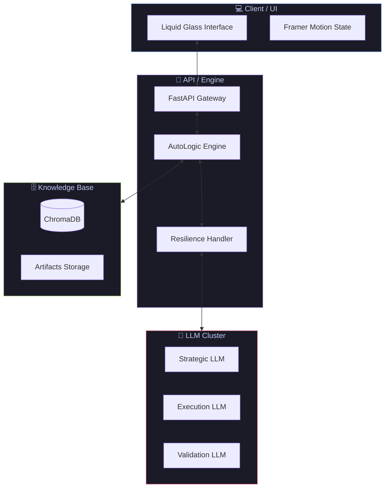
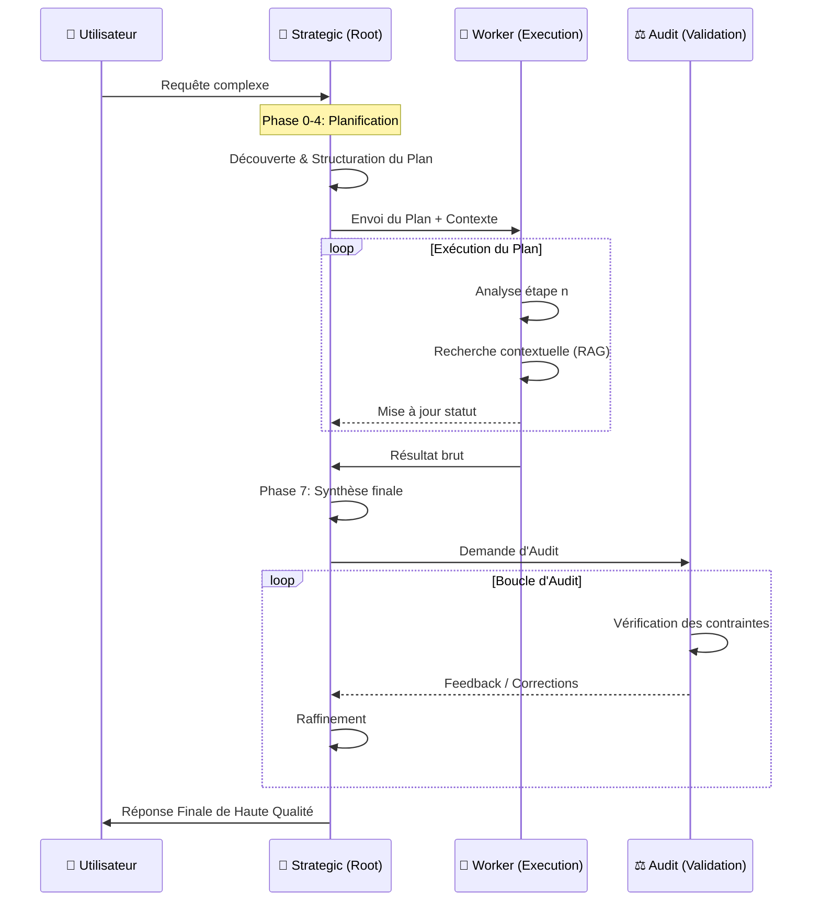
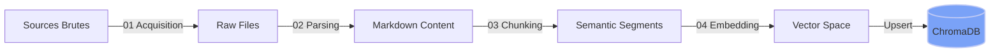

<div align="center">

# 🦖 AutoLogic
### *The Ultimate Autonomous Reasoning Engine*

[](https://python.org)
[](https://fastapi.tiangolo.com)
[](https://react.dev)
[](https://tailwindcss.com)
[](https://vite.dev)
[](https://sonarqube.org)

**AutoLogic** est un moteur de raisonnement autonome de nouvelle génération implémentant le framework **Self-Discover** de Google DeepMind. Il ne se contente pas de répondre : il *pense*, *planifie*, *exécute* et *audite* ses propres solutions à travers un cycle cognitif rigoureux en 8 phases.

[📖 Documentation](Doc/sphinx/index.rst) · [🚀 Démarrage](start.sh) · [🏗️ Architecture](#️-architecture-systeme) · [✨ Fonctionnalités](#-fonctionnalites-cles)

</div>

---

## 🔮 À Propos

AutoLogic représente l'état de l'art en matière d'agents cognitifs autonomes. Contrairement aux approches de "Chain-of-Thought" (CoT) monolithiques, AutoLogic utilise une **bibliothèque dynamique de 106 modules de raisonnement atomiques**. 

Pour chaque tâche, le système :
1. **Découvre** les stratégies les plus pertinentes.
2. **Adapte** ces stratégies au contexte spécifique.
3. **Structure** un plan d'action complexe.
4. **Exécute** le plan avec un agent dédié.
5. **Audite** le résultat final selon des critères de qualité stricts.

L'expérience utilisateur est sublimée par une interface **Liquid Glass** (Glassmorphism 2025), offrant une transparence totale sur le "flux de pensée" de l'IA.

---

## 📖 Références Scientifiques

AutoLogic est une implémentation fidèle et étendue du framework présenté par Google DeepMind.

> **SELF-DISCOVER: Large Language Models Self-Compose Reasoning Structures**  
> *Zhou et al., arXiv:2402.03620 (2024)*  
> 🔗 [https://arxiv.org/abs/2402.03620](https://arxiv.org/abs/2402.03620)

### Avantages vs CoT Classique
- **Performance** : +32% sur BigBench-Hard.
- **Efficience** : 10x à 40x moins de calculs que la Self-Consistency.
- **Transférabilité** : Les structures de raisonnement découvertes par un modèle puissant (Root) peuvent être exécutées par des modèles plus petits (Worker).

---

## ✨ Fonctionnalités Clés

| Pilier | Technologie | Impact |
| :--- | :--- | :--- |
| **🧠 Moteur Cognitif** | Framework Self-Discover | Raisonnement structuré multi-étapes. |
| **🕵️ Orchestration Triple Agent** | Strategic, Worker, Audit | Séparation des responsabilités (Planification vs Exécution). |
| **📚 RAG Hybride** | ChromaDB + Semantic Chunking | Accès à une base de connaissances externe fiable. |
| **🎨 UI Liquid Glass** | React 19 + Framer Motion | Interface immersive et réactive. |
| **🛡️ Résilience Engine** | Exponential Backoff + Fallbacks | Fiabilité à 99.9% sur les appels LLM. |
| **📊 Audit H2** | Heuristic Validator | Garantie de qualité et de conformité du résultat. |

---

## 🏗️ Architecture Système

AutoLogic repose sur une architecture découplée permettant une orchestration fluide entre le cerveau (Root), les mains (Worker) et les yeux (Audit).

### 1. Vue d'ensemble Globale



### 2. Flux de Raisonnement (Triple Agent)



---

## 📂 Structure du Projet (Mandat Senior)

Le projet suit une organisation rigoureuse pour garantir la maintenabilité :

```text
AutoLogic/
├── Cmd/                    # Scripts standalone (.sh) de déploiement
├── Code/                   # Coeur de l'application
│   ├── Backend/            # API & Moteur Inférence
│   │   ├── Phase1-Ingestion/  # Pipeline RAG (Acquisition -> Embedding)
│   │   └── Phase2-Inference/  # Moteur Self-Discovery & Agents
│   └── Frontend/           # UI React (Vite + Tailwind)
├── Config/                 # Configuration centralisée (YAML)
├── Doc/                    # Documentation technique (Sphinx)
├── Log/                    # Journaux d'exécution & Traces
├── Test/                   # Suite de tests (Pytest, Vitest)
└── artifacts/              # Preuves de travail et plans validés
```

---

## 🔄 Phase 1 : Pipeline RAG (Ingestion)

Avant le raisonnement, les données passent par un pipeline de transformation robuste.



1. **Acquisition** : Collecte multi-source (API, S3, PDF).
2. **Parsing** : Nettoyage et conversion via OCR (si nécessaire) en Markdown normalisé.
3. **Chunking** : Découpage sémantique intelligent avec chevauchement contextuel.
4. **Embedding** : Vectorisation via des modèles SOTA (OpenAI text-3, Cohere).

---

## 🧠 Phase 2 : Cycle Self-Discovery (Les 8 Phases)

Le processus cognitif est décomposé en 8 étapes atomiques :

| # | Phase | Agent | Responsabilité | Output |
| :--- | :--- | :--- | :--- | :--- |
| **0** | **Analyze** | Root | Compréhension profonde, intention et contraintes. | `IntentObject` |
| **1** | **Select** | Root | Choix des modules pertinents parmi les 106 dispos. | `SelectedModules` |
| **2** | **Adapt** | Root | Contextualisation des modules abstraits en instructions. | `AdaptedPlan` |
| **3** | **Structure** | Root | Ordonnancement logique et dépendances du plan. | `ReasoningPlan` |
| **4** | **Verify** | Root | Vérification de la cohérence logique avant action. | `ApprovalStatus` |
| **5** | **Execute** | Worker | Exécution séquentielle et accumulation de preuves. | `RawResult` |
| **6** | **Critic H2** | Root | Évaluation heuristique de la qualité (score 0-1). | `CriticScore` |
| **7** | **Synthesis** | Audit | Raffinement final et validation des contraintes. | **FinalAnswer** |

---

## 📊 La Bibliothèque des 106 Modules Cognitifs

AutoLogic tire sa puissance d'une bibliothèque exhaustive organisée en 18 catégories spécialisées.

### Vue d'ensemble des Catégories

| # | Catégorie | Nb Modules | Focus |
| :--- | :--- | :--- | :--- |
| 1 | Décomposition du problème | 4 | Analyse granulaire |
| 2 | Pensée critique | 6 | Évaluation et biais |
| 3 | Pensée créative | 5 | Innovation |
| 4 | Pensée analytique | 5 | Logique & Données |
| 5 | Pensée systémique | 4 | Vision d'ensemble |
| 6 | Prise de décision | 6 | Choix & Compromis |
| 7 | Collaboration | 3 | Consensus |
| 8 | Vérification | 4 | Tests & Cohérence |
| 9 | Exécution | 2 | Suivi & Action |
| 10 | Raisonnement Modal | 7 | Possibilités & Nécessités |
| 11 | Raisonnement Abductif | 7 | Hypothèses & Analogies |
| 12 | Raisonnement Multi-niveau | 8 | Abstraction |
| 13 | Raisonnement Bayésien | 7 | Incertitude |
| 14 | Métacognition | 8 | Auto-monitoring |
| 15 | Raisonnement Symbolique | 8 | Logique Formelle |
| 16 | Domaine Spécifique | 7 | Expertise (Math, Physics, Law) |
| 17 | Raisonnement Visuel | 7 | Spatial & Diagrammes |
| 18 | Raisonnement Itératif | 8 | Raffinement |

### Liste Exhaustive des Modules

<details>
<summary>Cliquez pour voir les 106 modules détaillés</summary>

#### 1. Décomposition du problème
- **Décomposer le problème** : Fragmenter en sous-problèmes gérables.
- **Identifier les contraintes** : Lister toutes les limitations techniques et business.
- **Identifier les inputs & outputs** : Cartographier les flux de données.
- **Clarifier les objectifs** : Définir des metrics de succès claires.

#### 2. Pensée critique
- **Identifier les hypothèses** : Déceler les préjugés et postulats.
- **Évaluer les risques** : Anticiper les points de défaillance.
- **Analyser les biais** : Neutraliser les biais cognitifs (ancrage, confirmation).
- **Évaluer les conséquences** : Analyse d'impact court et long terme.
- **Simplifier le problème** : Appliquer le rasoir d'Ockham.
- **Évaluer critiquement** : Vérifier la fiabilité des sources.

#### 3. Pensée créative
- **Brainstorming** : Génération d'options sans censure.
- **Hors des sentiers battus** : Pensée latérale.
- **Pensée systémique** : Interconnexions globales.
- **Risques et opportunités** : Détecter l'avantage caché.
- **Pensée réflexive** : Utiliser l'expérience passée.

#### 4. Pensée analytique
- **Cause-effet** : Chaînes de causalité.
- **Pensée inductive** : Patterns via exemples.
- **Pensée déductive** : Conclusions logiques.
- **Prioriser** : Matrice d'Eisenhower.
- **Données pertinentes** : Extraction des variables clés.

#### 5. Pensée systémique
- **Parties prenantes** : Cartographie des acteurs impactés.
- **Dépendances** : Liens inter-systèmes.
- **Effets de second ordre** : "Et ensuite ?"
- **Pensée holistique** : Anti-réductionnisme.

#### 6. Prise de décision
- **Critères de décision** : Cadre d'évaluation.
- **Peser les alternatives** : Analyse comparative.
- **Compromis** : Équilibrage des forces.
- **Décider sous incertitude** : Stratégie robuste/minimax.
- **Planifier l'implémentation** : Roadmap concrète.
- **Prévoir les obstacles** : Plan B/Mitigation.

#### 7. Collaboration
- **Perspectives multiples** : Intelligence collective.
- **Faciliter le consensus** : Recherche de l'accord optimal.
- **Communiquer clairement** : Vulgarisation et persuasion.

#### 8. Vérification
- **Tester la solution** : Validation par l'exemple.
- **Vérifier la cohérence** : Non-contradiction interne.
- **Itérer et améliorer** : Boucle de feedback.
- **Documenter** : Traçabilité du raisonnement.

#### 9. Exécution
- **Étape par étape** : Décomposition temporelle.
- **Surveiller les progrès** : KPIs d'exécution.

#### 10. Raisonnement modal et intensionnel
- **Modal Necessity** : Nécessaire, possible, impossible.
- **Counterfactual Analysis** : "Que se passerait-il si..."
- **Intensional Context** : Croyances et contextes.
- **Deontic Reasoning** : Obligations et permissions.
- **Epistemic Uncertainty** : Niveaux de savoir.
- **Temporal Logic** : Évolution dans le temps.
- **Alethic Assessment** : Vérité contingente vs nécessaire.

#### 11. Raisonnement abductif et génératif
- **Abductive Hypothesis** : Meilleure explication probable.
- **Analogical Transfer** : Transfert de solution trans-domaine.
- **Case-Based Reasoning** : Adaptation de cas passés.
- **Pattern Induction** : Généralisation par l'exemple.
- **Prototype Classification** : Représentativité.
- **Exemplar Reasoning** : Collection d'instances mémorisées.
- **Schema Induction** : Structure mentale organisatrice.

#### 12. Raisonnement multi-niveau et compositionnalité
- **Compositional Semantic** : Atomes sémantiques.
- **Hierarchical Abstraction** : Du concret à l'abstrait.
- **Marr's Three Levels** : Computationnel, Algorithmique, Implémentation.
- **Part-Whole Mereological** : Émergence des propriétés.
- **Spatial-Topological** : Relations spatiales.
- **Scale-Invariant Pattern** : Auto-similarité.
- **Multi-Level Causal** : Micro/Macro causalité.
- **Emergent Property** : Comportements systémiques.

#### 13. Raisonnement bayésien et probabiliste
- **Evidence Integration** : Mise à jour des croyances (Bayes).
- **Causal Network** : Réseaux bayésiens.
- **Explain-Away** : Rivalité d'hypothèses.
- **Multi-Hypothesis Cascaded** : Inférence en cascade.
- **Uncertainty Propagation** : Diffusion de l'incertitude.
- **Prior Knowledge Elicitation** : Activation des priors.
- **Maximum Likelihood** : Vraisemblance maximale.

#### 14. Métacognition et contrôle exécutif
- **Self-Monitoring** : Surveillance en temps réel.
- **Strategic Planning** : Sélection de l'approche globale.
- **Cognitive Load Management** : Optimisation de la mémoire.
- **Attention Allocation** : Focus sélectif.
- **Error Detection** : Auto-correction.
- **Invariant Validation** : Respect des règles immuables.
- **Reflective Abstraction** : Extraction de principes.
- **Dual Process Integration** : Système 1 & 2.

#### 15. Raisonnement symbolique et formel
- **First-Order Logic** : Déduction formelle.
- **Constraint Satisfaction** : CSP / Backtracking.
- **Theorem Proving** : Preuve de correction.
- **Inference Chaining** : Chaînage avant/arrière.
- **Subproblem Memoization** : Programmation dynamique.
- **Quantifier Elimination** : Simplification logique.
- **Vector-Symbolic** : Hybride Neuro-Symbolique.
- **Graph-Based Inference** : Algorithmes de graphes.

#### 16. Raisonnement domaine-spécifique
- **Physics-Based Causal** : Lois de la physique.
- **Mathematical Pattern** : Structures mathématiques.
- **Algorithmic Complexity** : Big O analysis.
- **Domain Heuristic** : Règles d'expert.
- **Legal Precedent** : Raisonnement juridique.
- **Medical Diagnostic** : Différentiel médical.
- **Engineering Trade-off** : Optimisation multicritère.

#### 17. Raisonnement visuel et multimodal
- **Spatial Transformation** : Rotation/Translation mentale.
- **Diagrammatic Reasoning** : Preuve par l'image.
- **Relational Visual** : Topologie visuelle.
- **Symbolic-Visual Integration** : Fusion sémantique/visuelle.
- **Multimodal Fusion** : Texte + Image + Data.
- **Pattern Completion** : Extrapolation visuelle.
- **Topological Invariance** : Propriétés invariantes.

#### 18. Raisonnement itératif et réflexif
- **Bloom-Reconstruct-Decide** : Cycle de génération créative.
- **Iterative Refinement** : Boucle d'amélioration continue.
- **Rumination** : Traitement profond des points bloquants.
- **Progressive Commitment** : Engagement graduel.
- **Backtracking and Revision** : Pivotage stratégique.
- **Consistency Maintenance** : Vérification de non-contradiction continue.
- **Solution Diversity** : Génération de Variantes.
- **Meta-Reasoning Quality** : Audit du processus.

</details>

---


## 🚀 Démarrage Rapide

### Configuration de l'environnement
1. Clonez le dépôt.
2. Copiez `.env.example` vers `.env` et renseignez vos clés API.
3. Le fichier `Config/global.yaml` contient les paramètres par défaut.

### Lancement via script unifié
```bash
./start.sh
```
Ce script effectue automatiquement :
- La vérification des prérequis (Python, Node).
- La création de l'environnement virtuel `.venv`.
- L'installation des dépendances.
- Le lancement du Backend (8000) et du Frontend (5173).
- L'ouverture automatique de Google Chrome.

---

## 🛠️ Stack Technique

### Backend (Python)
- **Framework** : FastAPI
- **LLM Context** : LangChain / LangGraph
- **Database** : ChromaDB (Vectorial), PostgreSQL (Metadata)
- **Validation** : Pydantic (Strong Typing)

### Frontend (Modern Stack)
- **Framework** : React 19 + TypeScript
- **Styling** : Tailwind CSS 4 (Liquid Glass effects)
- **Animations** : Framer Motion
- **Tooling** : Vite 7

---

## 🛡️ Standards de Qualité & Sécurité

- **Typage Strict** : Python avec Mypy (PEP 484) et TypeScript.
- **Qualité de Code** : Validation via SonarQube & Flake8.
- **Sécurité** : Aucune clé en dur, isolation totale du workspace.
- **Tests** : TDD via Pytest (Backend) et Vitest (Frontend).

---

## 🤝 Contribution

Nous suivons le protocole **"Think-Act"**. Toute modification majeure doit :
1. Être précédée d'un plan dans `artifacts/`.
2. Passer la suite de tests `Test/`.
3. Respecter le design system Apple HIG.

---

<div align="center">
  <p>Fait avec ❤️ par l'équipe AutoLogic</p>
  <strong>🦖 Architecture Senior - Artifact-First Protocol</strong>
</div>
